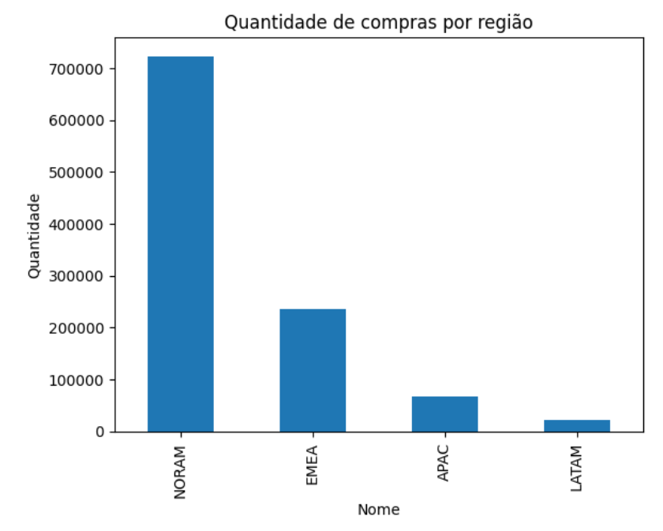
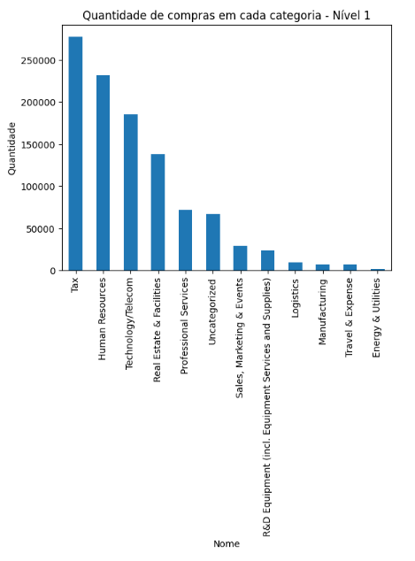
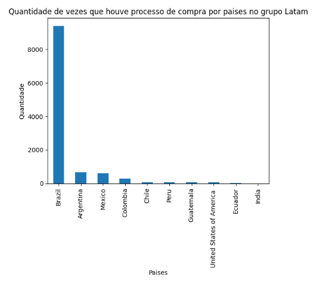
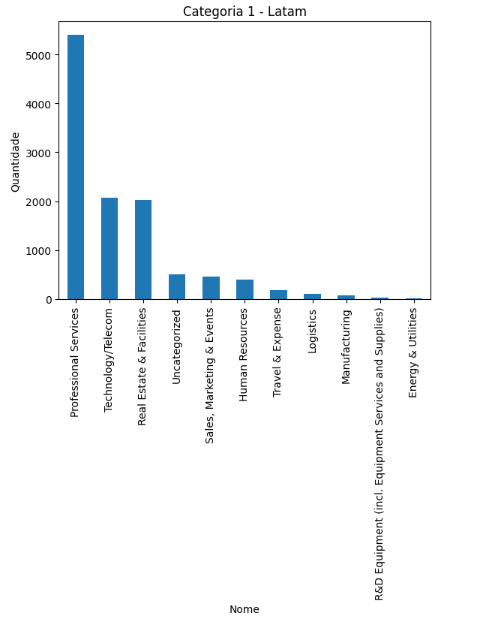
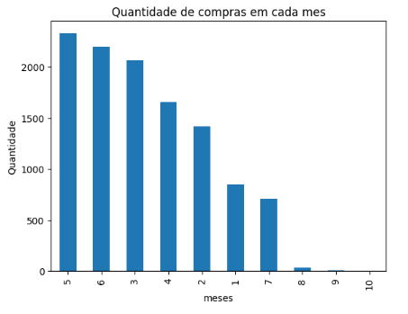
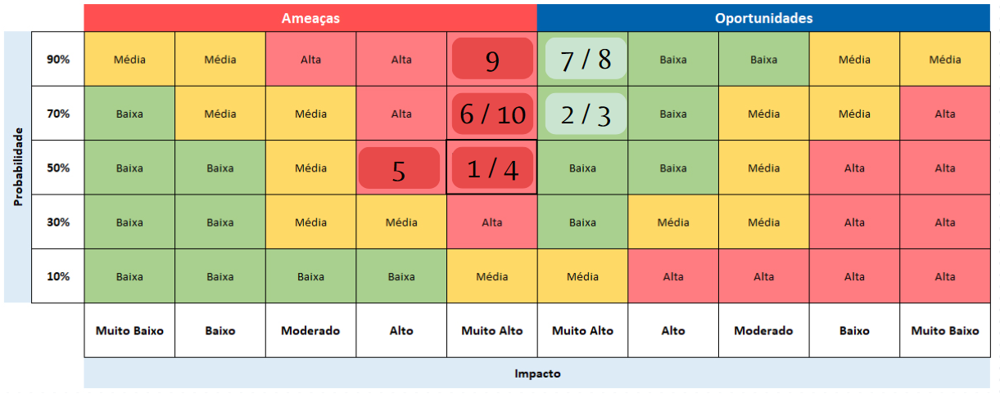
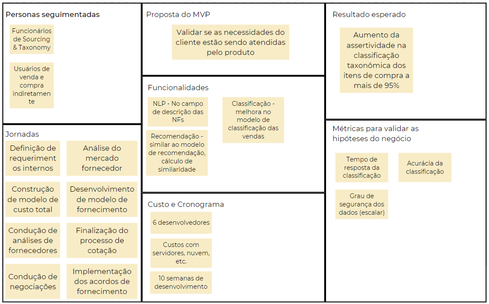
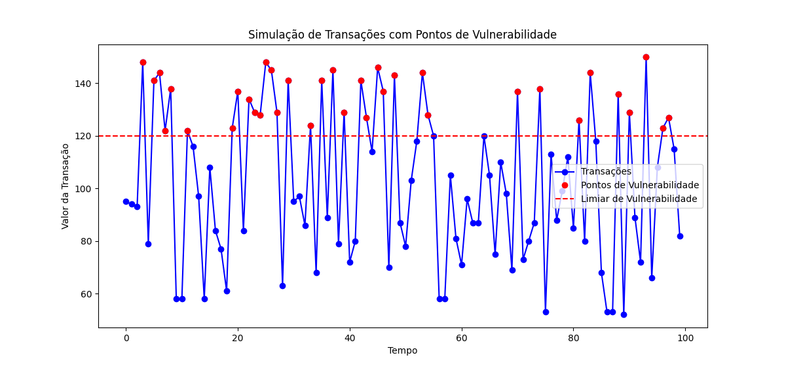

# Inteli - Instituto de Tecnologia e Liderança 

 

#  Projeto de arquitetura de software - Classificação e Taxonomia em Sourcing

**Nome do Parceiro:** Meta

**Nome do Grupo:** 4

**Integrantes do grupo:** Bruno Meira, Luísa Leite, Marcos Florencio, Marcos Moura, Pedro Gattai e Priscila Falcão.

# Visão geral do projeto

A Meta, anteriormente conhecida como Facebook, Inc., é uma das empresas de tecnologia mais influentes do mundo. Fundada por Mark Zuckerberg em 2004, a Meta se tornou uma potência no setor de mídias sociais, oferecendo plataformas como o Facebook, Instagram e WhatsApp, que conectam bilhões de pessoas globalmente. A empresa não apenas se concentra em criar experiências de mídia social, mas também está envolvida em inovações como realidade virtual, realidade aumentada e inteligência artificial. Sua missão é conectar o mundo e permitir experiências sociais inovadoras.

A área de Strategic Sourcing (aquisições estratégicas) na Meta desempenha um papel fundamental na gestão das operações da empresa. A equipe de Strategic Sourcing trabalha em estreita colaboração com fornecedores para garantir que os recursos essenciais sejam adquiridos de maneira eficaz e estratégica, desempenhando um papel crucial na sustentação do sucesso contínuo da empresa.

Dentro dessa área, a atividade de classificação e taxonomia se destacam. O sistema de taxonomia e classificação de notas fiscais é fundamental para empresas como a Meta, que operam globalmente e gerenciam uma ampla gama de transações comerciais. Esse sistema tem a responsabilidade de classificar e organizar todas as notas fiscais recebidas e emitidas pela empresa de forma a garantir o cumprimento das obrigações fiscais, além de facilitar a análise e o gerenciamento de despesas e receitas.

Em resumo, o sistema de taxonomia e classificação de notas fiscais na Meta desempenha um papel crítico na manutenção da conformidade fiscal e na gestão financeira eficaz, fornecendo insights valiosos sobre as operações comerciais e os gastos da empresa em escala global.

# Descrição do problema

A empresa enfrenta um desafio crítico relacionado ao seu sistema de classificação de notas fiscais. Embora possua uma infraestrutura sólida de inteligência artificial dedicada a essa tarefa, a atual IA está entregando apenas 65% de precisão nas classificações. Isso está levando a inconsistências e erros em todo o processo de classificação, o que afeta diretamente a eficiência operacional e a precisão contábil da empresa. 

Diante dessa situação, a empresa busca uma nova arquitetura que não apenas mantenha a segurança, disponibilidade e rastreabilidade dos dados, mas também promova uma melhoria significativa na precisão das classificações, garantindo que as atividades comerciais e financeiras sejam realizadas com maior confiabilidade e precisão. A busca por essa solução visa aprimorar a qualidade do sistema de classificação de notas fiscais, otimizando processos internos e proporcionando uma base sólida para as operações da empresa.

Além das implicações diretas na eficiência operacional, a atual limitação na acurácia do sistema de classificação de notas fiscais também impacta a tomada de decisões estratégicas da empresa. A classificação precisa e detalhada das atividades comerciais é fundamental para a análise de desempenho, alocação de recursos e conformidade fiscal. A inadequação do sistema atual prejudica a visão holística da empresa sobre suas operações e pode resultar em questões de conformidade tributária. Portanto, a empresa reconhece a importância de uma nova arquitetura que eleve a precisão das classificações para um nível que garanta a qualidade de suas operações e permita uma tomada de decisões mais informada e eficaz.

# Visão de Negócios

## Setor de aplicação

O setor de aplicação do sistema fornecido pela Meta é o setor comercial, tendo um impacto maior em empresas de pequeno porte que têm muitas contas a pagar. No entanto, ele também pode se estender a empresas de grande porte. Com esse sistema, é possível analisar e categorizar os gastos de forma mais eficiente, tornando possível tirar melhores conclusões sobre os gastos da empresa.

## Adição de valor

O valor agregado às empresas com essa solução é a possibilidade de a Meta realizar consultorias e fornecer orientações administrativas, permitindo que essas empresas melhorem seu desempenho e também aproveitem ao máximo tudo que a Meta oferece para impulsionar seus negócios. Isso cria uma situação em que tanto a Meta quanto a empresa que está recebendo o serviço saem ganhando. Quanto maior a empresa assistida se torna, mais ela tende a utilizar a plataforma da Meta, e quanto mais ela cresce, mais tende a faturar. Assim, estabelece-se uma relação de benefício mútuo entre ambas as partes.

## Processo de negócio e fluxos críticos suportados pelo sistema
O diagrama abaixo descreve todo o fluxo do negócio, dividindo ele em três parte. As vulnerabilidades do fluxo varia conforme o tipo de material que vai ser comprado, podendo ser falta de fornecedor no mercado, baixo poder de negociação, não chegar num valor final de volume e além de outros pontos críticos.

</img>

## Volumetrias
O database que usamos como base para fazer esses gráfico se encontra nesse link "https://docs.google.com/spreadsheets/d/1FmOdb-9_s2gwEvm8_0ayNdtvflRIKs7q/edit?usp=drive_link&ouid=118363649488026291327&rtpof=true&sd=true". 

O primeiro gráfico que temos é esse: 

</img>

Que mostra a quantidade de compras por região, e conseguimos ver que tem quatro regiões especificas NORAM, EMEA, APAC e LATAM.

Na coluna level 1 acontece a primeira categorização das compras que são esses tipos:
- 'Sales, Marketing & Events'
- 'R&D Equipment (incl. Equipment Services and Supplies)'
- 'Real Estate & Facilities'
- 'Technology/Telecom'
- 'Tax'
- 'Uncategorized' (que não chegou a nenhum tipo de categorização)
- 'Professional Services'
- 'Energy & Utilities'
- 'Manufacturing'
- 'Travel & Expense'
- 'Human Resources'
- 'Logistics'

</img>

Podemos perceber que no dataset que tem os dados de todas as regiões a principal despesa da categoria 1 é com Tax, que são basicamente impostos.

Depois quando analisamos um dataset onde só possui dados da região LATAM, o país que possui mais dados de compra é o Brasil:

</img>

E nele podemos perceber que na cetegorização 1 o prinpal gasto é com Professional Service:

</img>

E por último temos um gráfico que mostra a quantidade de compras de cada mês do ano de 2023:

</img>

Sendo o mês cinco (maio) o mês onde ocorreu o maior número de compras na região LATAM.

Todos esses gráficos forma feitos nesse colab "https://colab.research.google.com/drive/1AZDggAyRxMUCiAQ4iN8K7dxOj7EoebSc?usp=sharing".

## Estratégia de crescimento estabelecida

A estratégia que definimos como crescimento seria conseguir montarmos um database com mais confiabilidade e constância para analisarmos os dados e montarmos gráficos com dados em que conseguimos tirar algum tipo de estrátegia para o negócio de forma real, principalmente dados esses que ajudaria nas possiveis vulnerabilidades dos fluxo de negócio montado no item 3.

## Riscos e oportunidades

</img>

1- Não conseguirmos ter uma assertividade acima de 95% na taxonomia;  
2- Transformação da área de compras para um papel mais estratégico do que operacional;  
3- Transformamos o processo de compras em algo de alto impacto positivo para a empresa;  
4- Vazamento de dados dos fornecedores e compradores;  
5- A complexidade do processamento de linguagem natural do sistema pode levar a atrasos, especialmente em picos de carga;  
6- Instabilidade no sistema devido a problemas técnicos não previstos resultando em períodos de indisponibilidade;  
7- Área de compras minimizar os custos com  materiais;  
8- Fortalecer a capacidade de negociação da equipe de compras para com os fornecedores;  
9- Sistema categorizar incorretamente a compra fazendo a empresa ter um custo maior com impostos;  
10 - Notas fiscais seguirem padrões diferentes fazendo com que o sistema não consiga extrair as informações necessárias para classificar a compra.

# Requisitos

## Requisitos não funcionais

Requisitos não funcionais, muitas vezes chamados de atributos de qualidade, são critérios que descrevem as propriedades e características do sistema ou software que não estão diretamente relacionados às funcionalidades principais, mas têm um impacto significativo na sua eficácia, desempenho e usabilidade.

Dessa forma, para o projeto foram levados em consideração algumas necessidades e vulnerabilidades do sistema atual, a fim de mapear os requisitos que deveriam ser atendidos na nova arquitetura. Assim, identificou-se na arquitetura atual as seguintes vulnerabilidades:
- Acuracidade em 65% nas classificações taxonômicas;
- Sistema não suporta um alto volume de invoices;
- Sistema possui monitoramento de logs e respostas, mas não de forma adequada para identificar o problema nas classificações;
- A partir da classificação do nível 1 é que se garante a classificação nos demais níveis  - se a classificação for feita de forma incorreta, os demais níveis também receberão classificações incorretas;

Vale destacar que para a listagem, foi usado o mecanismo Canvas MVP.

</img>

Assim, listou-se os requisitos não funcionais:
1. O sistema deve apresentar acurácia acima de 95% em acurácia nas classificações taxonômicas. 
2. Todas as etapas da cadeia de suprimentos deve ter monitoramento com logs e respostas do sistema.
3. A confiabilidade da classificação feita deve ser de 95%.
4. A arquitetura deve garantir o armazenamento dos dados de venda/fornecedores de forma 80% segura (não apresentar nenhuma falha de segurança).
5. O tempo de resposta do sistema de classificação deve ser de até 1 minuto e meio segundos por lote de classificação (30 invoices).
6. O tempo de processamento de linguagem natural da descrição da NFe deve ser de até 5 segundos, com extensão de até 3 segundos.
7. O sistema deve garantir tempo de consulta de até 5 segundos.
8. O sistema deve ser 90% do tempo disponível considerando sistema 24/7.  
9. Caso ocorra alguma falha durante o processo de venda, tanto o usuário, quanto a equipe desenvolvedora devem ser alertados.
10. O sistema deve ter suporte para erros e falhas no processo de classificação.

## Requisitos funcionais

Requisitos funcionais são uma parte fundamental da especificação de software e sistemas, descrevendo as funcionalidades e comportamentos que um sistema deve fornecer. Esses requisitos delineiam as ações específicas que o sistema deve ser capaz de realizar, como funções, operações ou interações com os usuários. 

Assim, listou-se os Requisitos Funcionais: 
11. O sistema será capaz de receber um alto volume de arquivos e classificá-lo.  
12. O sistema deve mostrar os 3 níveis de classificação feita. <br.>
13. A plataforma deve permitir a visualização de todas as categorias.  
14. O sistema deve ser capaz de interpretar diferentes invoices - considerando formatos e línguas.  
15. O tempo de resposta do sistema de classificação deve ser de até 10 segundos por classificação.  

# Arquitetura do Sistema Atual
O entendimento profundo da arquitetura de um sistema é um alicerce fundamental para o desenvolvimento eficaz de projetos de melhorias de software. A arquitetura serve como o plano mestre que guia o processo de desenvolvimento, fornecendo uma visão abrangente de como os componentes do sistema se interconectam e funcionam em conjunto. No entanto, em algumas situações, como a atual, em que não se tem acesso à arquitetura atual do sistema por questões de segurança, é possível recorrer a abordagens alternativas. Ao conduzir reuniões com os stakeholders e aproveitar sua experiência, foi possível pressupor o funcionamento da arquitetura existente, criando uma base sólida para planejar e implementar melhorias de software de maneira mais informada e precisa.

Embora a falta de acesso direto à arquitetura atual do sistema tenha sido um desafio a ser enfrentado pela equipe desenvolvedora, o diálogo contínuo com os stakeholders é uma ferramenta valiosa para preencher essa lacuna. Através dessas conversas, foi possível identificar os principais componentes do sistema, entender como eles se comunicam e mapear os fluxos de dados e processos. Esse conhecimento adquirido por meio das discussões permitiu criar uma representação conceitual da arquitetura existente, que serviu como base para o desenvolvimento das melhorias de software.

 

---

# Avaliação dos mecanismos de engenharia e de tecnologia utilizados no sistema atual (ATAM - Architecture Tradeoff Analysis Method).

## RNF-03: O sistema deve garantir que 100% dos dados não sofreram qualquer perda durante transações (época de venda).

### Descrição da Entrada

Durante a époce de vendas, há uma entrada contínua de dados, incluindo informações de inventário, transações financeiras, detalhes do cliente e registros de vendas. Esses dados são dinâmicos e sensíveis, exigindo uma abordagem rigorosa para garantir sua integridade e consistência.

### Descrição da Saída

A saída desse processo é assegurar que todos os dados envolvidos nas transações de venda tenham sido registrados e armazenados sem qualquer perda. Isso implica na completa preservação e consistência dos registros de vendas, informações financeiras, atualizações de inventário e dados relacionados aos clientes.

### Abordagem de Controle

Para atender ao requisito RNF-03, o sistema deve implementar uma abordagem robusta e multicamadas para garantir a integridade dos dados durante as transações de venda. Pode ser usado mecanismos de Backup e Redundância, transações atômicas, protocolos de comunicação segura e testes de resiliência e recuperação de falhas.

## Descrição das táticas arquiteturais e componentes adotadas que ajudam a execução e o controle do RNF do sistema atual

### Monitoramento do Requisito

- Monitoramento de Transações em Tempo Real: Utilização de ferramentas de monitoramento para acompanhar continuamente todas as transações de venda, verificando a integridade dos dados durante o processo.

- Registros de Logs Detalhados: Manutenção de registros detalhados das transações, permitindo a análise retroativa em caso de qualquer suspeita de perda de dados.

- Alertas de Integridade de Dados: Configuração de alertas automáticos para notificar imediatamente a equipe responsável caso ocorram quaisquer discrepâncias ou falhas na integridade dos dados.

### Resolução Preventiva e Reativa

- Implementação de Protocolos Redundantes: Utilização de sistemas redundantes e backups contínuos para prevenir a perda de dados, garantindo que as informações estejam sempre replicadas e prontas para restauração.

- Testes de Stress e Resiliência: Realização periódica de testes de estresse para identificar potenciais pontos fracos no sistema, permitindo correções preventivas antes que problemas reais ocorram.

- Atualizações de Segurança e Manutenção Regular: Manutenção contínua do sistema, incluindo atualizações de segurança e correções de bugs, para garantir a estabilidade e integridade dos dados.

- Procedimentos de Backup e Restauração Rápida: Em caso de perda de dados, acionar imediatamente os procedimentos de restauração a partir dos backups mais recentes para minimizar a perda de informações.

- Análise de Causa Raiz: Realização de uma análise detalhada para identificar a causa da perda de dados e implementar medidas corretivas para evitar recorrências

### Recuperação e Mitigação de Impactos

- Restauração Gradual de Serviços: Priorizar a restauração dos serviços essenciais e críticos gradualmente, minimizando o impacto nas operações.

- Avaliação de Danos e Compensação: Avaliar os danos causados pela perda de dados e tomar medidas apropriadas para compensar clientes ou partes afetadas, se necessário.
  

## RNF-04: A arquitetura deve garantir o armazenamento dos dados de venda/fornecedores de forma 80% segura (não apresentar nenhuma falha de segurança).

### Descrição da Entrada

A entrada será dos dados de venda e informações dos fornecedores e requisitos de segurança definidos (80% de segurança sem falhas).

### Descrição da Saída

Armazenamento seguro dos dados de venda/fornecedores atendendo a um nível de segurança de 80%, sem nenhuma falha de segurança detectada. Essa abordagem procura criar uma estrutura sólida que proteja os dados sensíveis, cumprindo o requisito de segurança estabelecido, enquanto permite o funcionamento eficiente do sistema de armazenamento.

### Abordagem de Controle

Pode ser feito por meio de Monitoramento contínuo: Implementação de ferramentas de monitoramento e auditoria para detectar atividades suspeitas ou tentativas de acesso não autorizado. Isso permitirá a resposta rápida a possíveis ameaças.

## Descrição das táticas arquiteturais e componentes adotadas que ajudam a execução e o controle do RNF do sistema atual

### Monitoramento do Requisito

- Análise contínua: Monitoramento regular dos sistemas de segurança para identificar qualquer desvio ou potencial violação das políticas estabelecidas para a segurança dos dados.
- Relatórios e métricas: Gerar relatórios periódicos que detalham a conformidade com os padrões de segurança definidos, destacando áreas de melhoria e eventuais lacunas.

### Resolução Preventiva e Reativa

- Prevenção: Implementação de medidas proativas, como atualizações regulares de segurança, treinamento de equipe em conscientização sobre segurança e revisão constante das políticas de segurança.
- Resposta reativa: Em caso de violação ou identificação de riscos, resposta imediata para conter e resolver o problema, como a remoção de acesso não autorizado e a correção de brechas de segurança.

### Recuperação e Mitigação de Impactos

- Recuperação de dados: Estratégias e protocolos definidos para restaurar dados após uma falha, utilizando backups seguros e processos de recuperação testados.
- Mitigação de impactos: Avaliação dos impactos da violação de segurança e ações para reduzir esses efeitos, como a comunicação transparente com partes afetadas e implementação de medidas corretivas para evitar recorrências.

## RNF-05: O tempo de resposta do sistema de classificação deve ser de até 1 minuto e meio segundos por lote de classificação (30 invoices).

### Descrição da Entrada

Tratando do requisito de tempo de processamento da linguagem natural no campo de descrição da invoice, que é feita para a classificação taxonômica, destaca-se a entrada com monitoramento desconhecido, ou seja, não se tem dados suficientes para inferir como funciona no sistema atual.

### Descrição da Saída

a saída deve ser de até 5 segundos de processamento por invoice inserida, com margem de até 3 segundos (nota-se que sistemas simples de NLP podem levar menos de 1 segundo para o processamento de uma frase - que usualmente, é a extensão das descrições das Invoices).

### Abordagem de Controle

A abordagem de controle é feito por meio de registros de logs com timestamp, além de testes periódicos de estresse (para garantir que o sistema está funcionando dentro dos limites estabelecidos mesmo em situações extremas).

## Descrição das táticas arquiteturais e componentes adotadas que ajudam a execução e o controle do RNF do sistema atual

### Monitoramento do Requisito

Para o requisito de tempo de resposta do sistema de classificação, como citado, espera-se o monitoramento por meio de logs de cada classificação feita, com o registro de timestamp. Além disso, poderiam ser realizados periodicamente testes de verificação (chamadas de requisição para o processo de classificação com "Invoices testes").

### Resolução Preventiva e Reativa

Pensando em ações preventivas para o sistema garantir esse requisito, pensou-se no aperfeiçoamento dos hiper parâmetros usados no modelo de classificação.

### Recuperação e Mitigação de Impactos

Já para o tratamento dos impactos em caso de falha do sistema, pensou-se no cenário em que percebido o aumento de mais de 45 segundos do tempo definido, uma nova máquina/instância é inciada para a distribuição da carga de processamento.

## RNF-06: O tempo de processamento de linguagem natural da descrição da NFe deve ser de até 5 segundos, com extensão de até 3 segundos.
### Descrição da Entrada

Tratando do requisito de tempo de processamento da linguagem natural no campo de descrição da invoice, que é feita para a classificação taxonômica, destaca-se a entrada com monitoramento desconhecido, ou seja, não se tem dados suficientes para inferir como funciona no sistema atual.

### Descrição da Saída

a saída deve ser de até 5 segundos de processamento por invoice inserida, com margem de até 3 segundos (nota-se que sistemas simples de NLP podem levar menos de 1 segundo para o processamento de uma frase - que usualmente, é a extensão das descrições das Invoices).

### Abordagem de Controle

A abordagem de controle é feito por meio de registros de logs com timestamp, além de testes periódicos de estresse (para garantir que o sistema está funcionando dentro dos limites estabelecidos mesmo em situações extremas).

## Descrição das táticas arquiteturais e componentes adotadas que ajudam a execução e o controle do RNF do sistema atual

### Monitoramento do Requisito

Para o requisito de tempo de resposta do processamento de linguagem natural da descrição da invoice, sugere-se monitoramento similar ao requisito anterior, contando com logs acompanhados de timestamp, além de verificação automática periódica do processo por meio da chamada da API que executa o processamento.

### Resolução Preventiva e Reativa

Para ações preventivas, pensou-se na melhora de técnicas de vetorização dos resultantes do NLP, de forma que essas saíssem mais comprimidas.

### Recuperação e Mitigação de Impactos

Já para o tratamento dos impactos em caso de falha do sistema, pensou-se também no cenário em que percebido o aumento de mais de 8 segundos do tempo definido, uma nova máquina/instância é inciada para a distribuição da carga de processamento.

## RNF-07: O tempo de consulta para itens classificados não pode exceder 5 segundos

## Revisão do requisito não funcional e respectivas vulnerabilidades

### Descrição da Entrada

No sistema atual, a forma como é realizada a medição do tempo de consulta do sistema a uma classificação não foi fornecida à equipe. Entretanto, pode-se considerar que a entrada é o tempo sem monitoramento. 

### Descrição da Saída

Já a saída seria uma medição de tempo de consulta de 5.53 segundos (obtido a partir da simulação deste), necessitando assim, de uma otimização na comunicação do sistema.

### Abordagem de Controle

Nesse sentido, uma abordagem de controle que pode estar sendo utilizada no momento é a utilização de logs no código que marquem o horário de início e conclusão de uma consulta, para que a diferença de tempo dos dois seja definida e utilizada como norte para a otimização do sistema.

## Descrição das táticas arquiteturais e componentes adotadas que ajudam a execução e o controle do RNF do sistema atual

### Monitoramento do Requisito

A equipe implementará uma abordagem completa para monitorar a disponibilidade do sistema. Essa estratégia envolve a definição de métricas específicas para avaliar a disponibilidade, a instrumentação do código para registrar eventos relacionados à disponibilidade, o armazenamento centralizado dos dados, verificações regulares, alertas automáticos para situações de falha, integração com o sistema de monitoramento contínuo, análise periódica de tendências, implementação de testes operantes específicos para simular cenários realistas, geração de logs detalhados e aprimoramento contínuo do sistema de monitoramento. Essa abordagem abrangente garantirá uma compreensão detalhada da disponibilidade do sistema, possibilitando a identificação proativa de problemas e a implementação contínua de melhorias para atender aos requisitos de disponibilidade.

**1. Definição de Métricas:**
- Serão utilizados logs com o horário de início e fim de cada consulta a fim de medir o tempo que cada uma levou para retornar o resultado.
- Também serão armazenados os dados de qual foi a classificação consultada com o objetivo de verificar se há diferenciação de tempo baseada na característica dos itens pesquisados.

**2. Frequência de Verificação:**
- O sistema estará o tempo todo gerando logs do tempo de consulta.
- Um log de eventos é mantido para análise posterior dos testes automatizados.

### Resolução Preventiva e Reativa

Para evitar que o tempo de consulta exceda os 5 segundos ideais, será utilizada a seguinte estratégia:

**Cache de dados**
- Os dados de cada consulta serão armazenados temporariamente para que outros usuários acessem e consequentemente a duração completa dessa diminua, uma vez que a memória cache é mais rápida do que as outras.

Se a prevenção não for suficiente, então será utilizada a seguinte abordagem:

**Replicação da série**
- Caso um componente do sistema não volte a operar em tempo hábil, toda a série será replicada, o que gerará gastos adicionais imprevistos pela empresa.

### Recuperação e Mitigação de Impactos

**1. Revisão Pós-Incidente:**
- Análise detalhada após cada incidente para melhorar processos e prevenir recorrências.

**2. Aumento da CPU:**
- Avaliação e análise dos recursos de hardware disponíveis para o sistema, como capacidade de CPU e memória, garantindo que estejam dimensionados adequadamente.

## RNF-08: O sistema precisa estar operante por pelo menos 90% do tempo, considerando que estará disponível 24 horas por dia, 7 dias por semana

## Revisão do requisito não funcional e respectivas vulnerabilidades

### Descrição da Entrada

No sistema atual, a forma como é realizada a medição da disponibilidade do sistema não foi fornecida à equipe. Entretanto, pode-se considerar que a entrada é a disponibilidade sem monitoramento.

### Descrição da Saída

Já a saída seria uma medição de disponibilidade abaixo dos 90% ideais, necessitando assim, de uma mudança nos componentes do sistema.

### Abordagem de Controle

Nesse sentido, uma abordagem de controle que pode estar sendo utilizada no momento é a de testes operantes em uma máquina virtual na nuvem, a partir de scripts que rodem em um determinado intervalo de tempo e que retornam para um aplicativo mobile, se o sistema estava operante naquele momento ou não.

## Descrição das táticas arquiteturais e componentes adotadas que ajudam a execução e o controle do RNF do sistema atual

### Monitoramento do Requisito

A equipe adotará uma estratégia abrangente para monitorar a disponibilidade do sistema, incluindo definição de métricas, instrumentação do código, armazenamento centralizado de dados, verificações regulares, alertas automáticos, integração com monitoramento contínuo, análise de tendências, testes operantes específicos, geração de logs e aprimoramento contínuo. Essa abordagem permitirá uma compreensão detalhada da disponibilidade, facilitando a identificação proativa de problemas e melhorias contínuas.

**1. Definição de Métricas:**
- A cada ciclo de classificação, o sistema registra o resultado (sucesso ou falha).
- Estabelecimento de um limiar, no caso, se houver falha em 10 de 100 tentativas, consideraremos a situação como uma falha.

**2. Frequência de Verificação:**
- O sistema está o tempo todo verificando se os componentes estão operando.
- Um log de eventos é mantido para análise posterior dos testes automatizados.

### Resolução Preventiva e Reativa

Se for detectado que o limiar de falhas foi atingido, será adotada a seguinte abordagem preventiva:

**Alertas**
- Será enviado alertas para os responsáveis pela manutenção do sistema.
- Tais alertas irão escalando indo desde mensagens até ligações diretas para os operadores.

Se a prevenção não for suficiente, então será utilizada a seguinte abordagem:

**Replicação da série**
- Caso um componente do sistema não volte a operar em tempo hábil, toda a série será replicada, o que gerará gastos adicionais imprevistos pela empresa.

### Recuperação e Mitigação de Impactos

**1. Backup e Restore:**
- Implementação de backups regulares dos modelos e configurações do sistema.
- Capacidade de restaurar rapidamente para um estado anterior funcional em caso de falha crítica.

**2. Revisão Pós-Incidente:**
- Análise detalhada após cada incidente para melhorar processos e prevenir recorrências.

**3. Implementação de Redundância:**
- Desenvolvimento de sistemas redundantes para garantir continuidade do serviço em caso de falha crítica.

## RNF-09: Em situações de falha durante o processo de classificação, é imperativo que a equipe de suporte seja automaticamente notificada que o sistema entrou em estado de falha

## Revisão do requisito não funcional e respectivas vulnerabilidades

### Descrição da Entrada

A entrada para este requisito é o sistema de classificação processando Invoices. A entrada também envolve eventos específicos para criar uma falha no processo de classificação, como erros inesperados, tempo de processamento excedido ou qualquer condição que indique uma anomalia no fluxo de classificação.

### Descrição da Saída

A saída desse requisito é a notificação automática enviada para a equipe de suporte do sistema em caso de falha durante o processo de classificação. A notificação deve ser acionada automaticamente para garantir uma resposta rápida.

### Abordagem de Controle

A abordagem de controle para garantir que o requisito seja atendido envolve a implementação de testes automatizados realizados periodicamente a cada dia, esses testes criam a abordagem de criação de casos de teste específicos para simular falhas durante o processo de classificação. Esses casos de teste vão ser integrados a um framework de teste automatizado e executados regularmente como parte do processo de integração contínua. Essa abordagem de controle garante que a funcionalidade de notificação automática seja testada regularmente e que a equipe de suporte seja informada de maneira eficaz em caso de falha durante o processo de classificação.

## Descrição das táticas arquiteturais e componentes adotadas que ajudam a execução e o controle do RNF do sistema atual

### Monitoramento do Requisito

Para monitorar o requisito de notificação automática em situações de falha durante o processo de classificação, implementaremos um sistema de monitoramento contínuo como explicado anteriormente. Para isso também vamos estabelecer pontos de verificação durante o processo de classificação, onde o sistema avaliará se houve sucesso ou falha.

**1. Definição de Métricas:**
- A cada ciclo de classificação, o sistema registra o resultado (sucesso ou falha).
- Estabelecimento de um limiar, por exemplo, se houver falha em 3 de 5 tentativas, consideraremos a situação como uma falha.

**2. Frequência de Verificação:**
- O sistema verifica as métricas a cada ciclo de classificação.
- Para os testes automatizados a frequencia é diaria.
- Um log de eventos é mantido para análise posterior, tanto para as métricas do ciclo de classificação quanto para os testes automatizados.

### Resolução Preventiva e Reativa

Se detectarmos que o limiar de falha é atingido com frequência, iremos adotar a seguinte abordagem preventiva:

**1. Análise Automática de Causas:**
- Implementação de algoritmos de análise de causa raiz para determinar por que as falhas estão ocorrendo.
- Correção automática de problemas conhecidos quando possível.

**2. Atualização de Modelos:**
- Atualização automática dos modelos de classificação com base em novos dados disponíveis (Retroalimentação do modelo).
- Realização de treinamento do modelo em intervalos regulares para garantir relevância na atualização.

Se a prevenção não for suficiente e ocorrer uma falha, adotamos uma abordagem reativa:

**1. Notificação Automática:**
- Ao atingir o limiar de falha, um alerta é enviado automaticamente para a equipe de suporte.

**2. Autocorreção Temporária:**
- Iniciamos uma correção temporária automaticamente, como reverter para um modelo anterior funcional (Backup).

**3. Registro Detalhado de Eventos:**
- Um registro detalhado do evento de falha é mantido para análise pós-incidente.

### Recuperação e Mitigação de Impactos

**1. Backup e Restore:**
- Implementação de backups regulares dos modelos e configurações do sistema.
- Capacidade de restaurar rapidamente para um estado anterior funcional em caso de falha crítica.

**2. Revisão Pós-Incidente:**
- Análise detalhada após cada incidente para melhorar processos e prevenir recorrências.

**3. Implementação de Redundância:**
- Desenvolvimento de sistemas redundantes para garantir continuidade do serviço em caso de falha crítica.

## RNF-10: O sistema deve ter um nível básico de suporte para erros e falhas no processo de classificação. Isso inclui a implementação de uma instância de backup do serviço principal, bem como a capacidade de substituição automática em casos de falhas

## Revisão do requisito não funcional e respectivas vulnerabilidades

### Descrição da Entrada

A entrada para este requisito inclui a execução normal do serviço de classificação, bem como eventos que indicam erros ou falhas no processo. Isso pode envolver a detecção de exceções, timeouts ou qualquer condição que indique uma falha no serviço principal de classificação.

### Descrição da Saída

A saída para esse requisito é a ativação automática de uma instância de backup do serviço principal em caso de falha. A substituição automática deve garantir a continuidade do serviço com o mínimo de interrupção possível, a saída também pode incluir registros detalhados das falhas, a ativação da instância de backup e a confirmação da transição bem-sucedida para a instância de backup.

### Abordagem de Controle

A abordagem de controle envolve testes e monitoramento contínuos para garantir que o sistema atenda ao nível básico de suporte para erros e falhas. Isso pode incluir testes automatizados que simulam falhas específicas no serviço principal, forçando a ativação da instância de backup. Esses testes podem serão integrados a um pipeline de integração contínua para garantir a execução regular. Além disso, o sistema será configurado com monitoramento de saúde em tempo real. Isso inclui a monitoração de métricas como o status da instância principal, a carga de trabalho, o tempo de resposta e a disponibilidade. Se o sistema detectar uma falha ou um declínio nas métricas, a substituição automática deve ser acionada, garantindo a continuidade do serviço.

## Descrição das táticas arquiteturais e componentes adotadas que ajudam a execução e o controle do RNF do sistema atual

### Monitoramento do Requisito

Para garantir o nível básico de suporte para erros e falhas no processo de classificação, implementaremos monitoramento constante com foco na detecção rápida de problemas no serviço principal.

**1. Integridade do Serviço Principal:**
- Verificação periódica da integridade do serviço principal.
- Monitoramento de métricas relacionadas ao desempenho e disponibilidade.

**2. Funcionamento da Instância de Backup:**
- Verificação regular da instância de backup para garantir sua prontidão.
- Simulação de troca para confirmar a funcionalidade adequada em caso de substituição.

### Resolução Preventiva e Reativa

Para evitar falhas sempre que possível, iremos adotar as estratégias preventivas:

**1. Manutenção Preventiva:**
- Atualizações regulares do sistema e patches de segurança para prevenir vulnerabilidades.
- Limpeza de dados temporários e otimização de recursos para evitar sobrecarga.

**2. Verificação Pré-Falha:**
- Implementação de verificações regulares para identificar sinais de possível falha iminente.
- Substituição de componentes ou atualização de configurações com base nessas verificações.

Se ocorrer uma falha, implementamos ações reativas para minimizar o tempo de inatividade:

**1. Ativação Automática da Instância de Backup:**
- Detecção automática de falhas no serviço principal.
- Ativação automática da instância de backup para substituir o serviço principal.

**2. Registro Detalhado de Falhas:**
- Criação de registros detalhados das falhas para análise pós-incidente.
- Identificação automática da causa raiz sempre que possível.

**3. Notificação Automática:**
- Notificação automática à equipe de suporte sobre a ativação da instância de backup.

### Recuperação e Mitigação de Impactos

**1. Retorno Automático ao Serviço Principal:**
- Implementação de um mecanismo automático que retorna ao serviço principal assim que a falha é resolvida.

**2. Análise Pós-Incidente:**
- Análise detalhada após cada incidente para identificar melhorias contínuas.
- Atualizações automáticas do sistema com base nas lições aprendidas.

**3. Simulações Periódicas:**
- Realização de simulações regulares para testar a capacidade de recuperação do sistema.
- Ajustes automáticos com base nos resultados dessas simulações.
  
## RNF-11: O sistema deve suportar um alto volume de invoices.

## Revisão do requisito não funcional e respectivas vulnerabilidades

### Descrição da Entrada

A entrada para este requisito são as invoices do usuario podendo ser até 30 invoices por vez, entrando no sistema de classificação, para que possam ser processadas.

### Descrição da Saída

A saída para esse requisito são até 30 invoices classificadas e o sistema disponível novamente.

### Abordagem de Controle

o monitoramento é feito por um script presente em uma máquina aws EC2 que verifica se o sistema de invoice está disponível a  cada um minuto e trinta segundos.

## Descrição das táticas arquiteturais e componentes adotadas que ajudam a execução e o controle do RNF do sistema atual

### Monitoramento do Requisito

Para garantir o nível básico de suporte para o sistema suportar um grande numero de invoices, implementaremos monitoramento constante com foco na detecção rápida de problemas no serviço principal.

**1. Integridade do Serviço Principal:**
- Verificação a cada um minuto e meio da integridade do serviço principal, maquina EC2 presente na AWS.
- Monitoramento se o sistema de invoice esta conseguindo classificar as invoices, verificando se não está ocorrendo muitos erros em curtos espaços de tempo.

**2. Funcionamento da Instância de Backup:**
- Verificação regular da instância de backup para garantir sua prontidão.

Se ocorrer uma falha, implementamos ações reativas para minimizar o tempo de inatividade:

**1. Reinicialização do Sistema:**
- Sistema de invoice reiniciado.
- Verificação se o Sistema está funcionando após reiniciado
- O sistema ainda é reiniciado mais duas vezes, caso não tenha funcionado após a primeria reinicialização.

**2. Registro de Falhas:**
- Logs de todos os ocorridos no sistema
- Criação de registros detalhados das falhas para análise pós-incidente.
- Identificação automática da causa raiz sempre que possível.

**3. Notificação :**
- Acionamento do operador, para que tome as medidades nescessarias.

## Táticas arquiteturais que ajudam a execução e o controle do RNF

1.

2.

3. Para o requisito de consistência de dados as táticas são replicação de dados (utilizar estratégias de replicação de dados para garantir que, em caso de falha em um local, os dados possam ser recuperados de um local de backup ou réplica. Isso pode ser feito por meio de espelhamento de banco de dados), isolamento e controle de concorrência (utilizar técnicas de isolamento de transações e controle de concorrência para garantir que múltiplas transações não interfiram umas nas outras, evitando corrupção de dados ou perda durante o processamento simultâneo) e testes de resiliência (realizar testes de resiliência e simulação de falhas para validar a eficácia das estratégias de proteção de dados. Isso ajuda a identificar pontos fracos no sistema e aprimorar as medidas de segurança)

4. A criptografia de dados em repouso e em trânsito é um pilar fundamental na garantia da segurança dos dados de venda e fornecedores. Quando se trata do armazenamento em repouso, a criptografia é aplicada aos dados enquanto estão estacionados nos bancos de dados ou em qualquer meio de armazenamento, tornando-os ilegíveis para qualquer pessoa sem a chave de descriptografia adequada. Isso significa que mesmo que alguém consiga acessar esses dados, eles aparecerão como um amontoado de caracteres sem sentido, sem valor compreensível. Além disso, ao transmitir esses dados entre sistemas ou dispositivos, a criptografia entra em ação novamente, protegendo-os durante o tráfego pela internet ou por qualquer rede. Dessa forma, mesmo se interceptados, os dados permanecem inacessíveis e ilegíveis para qualquer pessoa sem a chave de decodificação correta, garantindo a confidencialidade e a integridade das informações sensíveis.

5. Para o requisito de tempo de resposta do sistema de classificação, como citado, espera-se o monitoramento por meio de logs de cada classificação feita, com o registro de timestamp. Além disso, poderiam ser realizados periodicamente testes de verificação (chamadas de requisição para o processo de classificação com "Invoices testes"). Pensando em ações preventivas para o sistema garantir esse requisito, pensou-se no aperfeiçoamento dos hiper parâmetros usados no modelo de classificação. Já para o tratamento dos impactos em caso de falha do sistema, pensou-se no cenário em que percebido o aumento de mais de 45 segundos do tempo definido, uma nova máquina/instância é inciada para a distribuição da carga de processamento.

6. Para o requisito de tempo de resposta do processamento de linguagem natural da descrição da invoice, sugere-se monitoramento similar ao requisito anterior, contando com logs acompanhados de timestamp, além de verificação automática periódica do processo por meio da chamada da API que executa o processamento. Para ações preventivas, pensou-se na melhora de técnicas de vetorização dos resultantes do NLP, de forma que essas saíssem mais comprimidas. Já para o tratamento dos impactos em caso de falha do sistema, pensou-se também no cenário em que percebido o aumento de mais de 8 segundos do tempo definido, uma nova máquina/instância é inciada para a distribuição da carga de processamento.

7. Na arquitetura de sistemas, estratégias específicas são cruciais para atender aos Requisitos Não Funcionais (RNF). A redundância é essencial para garantir alta disponibilidade, distribuindo o sistema em diferentes pontos, como máquinas virtuais em várias regiões de nuvem. O monitoramento contínuo alerta sobre problemas, enquanto a utilização de cache de dados mantém partes críticas acessíveis durante falhas temporárias. Essas táticas, quando combinadas, garantem eficiência nas consultas e controle efetivo dos RNF, reduzindo a dependência constante do banco de dados e proporcionando resiliência operacional.

8. No novo sistema, a implementação de táticas arquiteturais para atender aos Requisitos Não Funcionais (RNF) é potencializada pela adoção de microservices. A redundância é alcançada distribuindo os microservices em diferentes regiões de disponibilidade na nuvem, proporcionando flexibilidade e escalabilidade. Um sistema de monitoramento contínuo verifica cada microserviço, alertando os responsáveis em caso de problemas específicos. A estratégia de cache de dados é aplicada a nível de microservices, mantendo a disponibilidade mesmo em falhas locais.
As estratégias de alerta, como notificações e chamadas escalonadas, são implementadas para cada microserviço, permitindo uma resposta ágil. Em casos persistentes de testes negativos abaixo de 90%, a replicação da série pode ser feita de maneira granular, replicando apenas os microservices afetados. Essa abordagem equilibra eficiência e resiliência, mitigando impactos financeiros na nuvem. Em resumo, a arquitetura baseada em microservices fortalece a execução e controle dos RNF, oferecendo flexibilidade, escalabilidade e resiliência ao sistema.

9. Para garantir o acompanhamento eficiente do requisito de notificação automática em situações de falha durante o processo de classificação, será implementado um sistema de monitoramento contínuo. Esse sistema incluirá a criação de pontos de verificação ao longo do processo de classificação, nos quais será avaliado se houve êxito ou falha. Durante cada ciclo de classificação, o sistema registra o resultado obtido, identificando se o processo foi bem-sucedido ou se ocorreu uma falha. Além disso, será estabelecido um limiar para determinar quando uma situação deve ser considerada como falha. Por exemplo, se houver falha em 3 de 5 tentativas, essa condição será reconhecida como uma falha. A verificação das métricas ocorrerá a cada ciclo de classificação, proporcionando uma análise frequente do desempenho do sistema. No contexto dos testes automatizados, a frequência de verificação será diária, assegurando uma monitorização regular e oportuna. Para permitir uma revisão posterior e uma compreensão mais aprofundada, um log de eventos será mantido. Esse registro abrangerá tanto as métricas relacionadas ao ciclo de classificação quanto aquelas provenientes dos testes automatizados. Essa abordagem visa garantir a eficácia do monitoramento contínuo, proporcionando insights valiosos para aprimorar a confiabilidade do processo de classificação.

10. Para assegurar o nível essencial de suporte a erros e falhas no processo de classificação, será implementado um monitoramento constante, concentrado na detecção ágil de problemas no serviço principal. Esse acompanhamento abrangerá dois aspectos cruciais para a operacionalidade confiável do sistema: Integridade do Serviço Principal - Serão realizadas verificações periódicas da integridade do serviço principal, englobando a avaliação contínua de métricas relacionadas ao desempenho e disponibilidade. Esse processo sistemático permitirá identificar prontamente qualquer anomalia ou degradação no funcionamento do serviço principal, possibilitando a aplicação de correções imediatas. Funcionamento da Instância de Backup: A manutenção da confiabilidade do sistema será reforçada por verificações regulares da instância de backup, garantindo sua prontidão para uma potencial substituição. Além disso, será realizada a simulação de troca para confirmar a funcionalidade adequada da instância de backup, assegurando uma transição suave em casos de necessidade de acionamento da instância de contingência. Esse cuidadoso monitoramento da instância de backup visa prevenir lacunas no serviço e garantir uma resposta eficaz diante de eventualidades, contribuindo para a robustez e resiliência do sistema como um todo.

 

---

# Modelo de simulação do atual

Você pode encontrar a simulação [neste diretório](https://github.com/2023M8T3Inteli/Grupo-04/blob/main/Simulacao/system_critical_points.py).

## Modelo de Simulação de Pontos Críticos

Este é o modelo de simulação que destaca os pontos de vulnerabilidade evidenciados nas transações realizadas ao longo do tempo, refletindo a situação atual do sistema. As transações são entendidas como os processos de compra e sua classificaçao.

Foi feita uma simulação de transações (PO) ao longo do tempo que destaca os pontos de vulnerabilidade. Os pontos de vulnerabilidade são identificados quando as transações ultrapassam um limiar predefinido. Eles são marcados em vermelho no gráfico, enquanto o limiar de vulnerabilidade é representado por uma linha tracejada vermelha.

## Resultados da simulação

A simulação demonstra que, com base nos dados gerados, há uma considerável quantidade de transações que ultrapassam o limiar de vulnerabilidade predefinido. Isso indica a presença de pontos de risco dentro do sistema. Para mitigar esses riscos, é necessário implementar medidas de segurança adicionais para evitar transações que excedam esse limiar. Isso pode incluir revisões de segurança mais rigorosas, autenticação adicional para transações de alto valor, ou outras medidas de segurança cibernética. Além disso, a identificação de pontos de vulnerabilidade fornece oportunidades para fortalecer a segurança do sistema, garantindo a integridade das transações e protegendo os dados sensíveis dos usuários.

