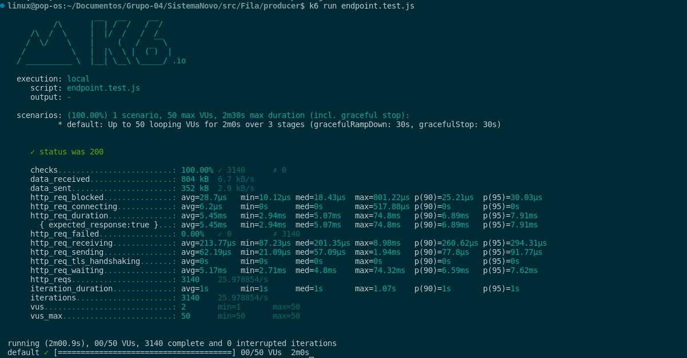
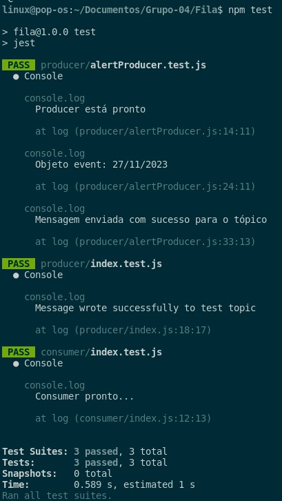

# Sumário

- [Visão Geral do Projeto](#visão-geral-do-projeto)
- [Descrição do problema](#descrição-do-problema)
- [Mapeamento dos Requisitos](#mapeamento-dos-requisitos)
- [Especificação da solução técnica do novo sistema](#especificação-da-solução-técnica-do-novo-sistema)
- [Visão Modelo Comportamental - Simulações](#visão-modelo-comportamental)
- [Arquitetura do novo sistema - Implementação](#arquitetura-do-novo-sistema)
- [Ajustes de implementação](#ajustes-de-implementação)
- [Identificação dos tradeoffs arquiteturais](#identificação-dos-tradeoffs-arquiteturais)
- [Medições do sistema](#medições-do-sistema)
- [Test Driven Development](#test-driven-development)
- [Referências bibliográficas](#referências-bibliográficas)

# Visão geral do projeto

A Meta, anteriormente conhecida como Facebook, Inc., é uma das empresas de tecnologia mais influentes do mundo. Fundada por Mark Zuckerberg em 2004, a Meta se tornou uma potência no setor de mídias sociais, oferecendo plataformas como o Facebook, Instagram e WhatsApp, que conectam bilhões de pessoas globalmente. A empresa não apenas se concentra em criar experiências de mídia social, mas também está envolvida em inovações como realidade virtual, realidade aumentada e inteligência artificial. Sua missão é conectar o mundo e permitir experiências sociais inovadoras.

A área de Strategic Sourcing (aquisições estratégicas) na Meta desempenha um papel fundamental na gestão das operações da empresa. A equipe de Strategic Sourcing trabalha em estreita colaboração com fornecedores para garantir que os recursos essenciais sejam adquiridos de maneira eficaz e estratégica, desempenhando um papel crucial na sustentação do sucesso contínuo da empresa.

Dentro dessa área, a atividade de classificação e taxonomia se destacam. O sistema de taxonomia e classificação de notas fiscais é fundamental para empresas como a Meta, que operam globalmente e gerenciam uma ampla gama de transações comerciais. Esse sistema tem a responsabilidade de classificar e organizar todas as notas fiscais recebidas e emitidas pela empresa de forma a garantir o cumprimento das obrigações fiscais, além de facilitar a análise e o gerenciamento de despesas e receitas.

Em resumo, o sistema de taxonomia e classificação de notas fiscais na Meta desempenha um papel crítico na manutenção da conformidade fiscal e na gestão financeira eficaz, fornecendo insights valiosos sobre as operações comerciais e os gastos da empresa em escala global.

# Descrição do problema

A empresa enfrenta um desafio crítico relacionado ao seu sistema de classificação de notas fiscais. Embora possua uma infraestrutura sólida de inteligência artificial dedicada a essa tarefa, a atual IA está entregando apenas 65% de precisão nas classificações. Isso está levando a inconsistências e erros em todo o processo de classificação, o que afeta diretamente a eficiência operacional e a precisão contábil da empresa.

Diante dessa situação, a empresa busca uma nova arquitetura que não apenas mantenha a segurança, disponibilidade e rastreabilidade dos dados, mas também promova uma melhoria significativa na precisão das classificações, garantindo que as atividades comerciais e financeiras sejam realizadas com maior confiabilidade e precisão. A busca por essa solução visa aprimorar a qualidade do sistema de classificação de notas fiscais, otimizando processos internos e proporcionando uma base sólida para as operações da empresa.

Além das implicações diretas na eficiência operacional, a atual limitação na acurácia do sistema de classificação de notas fiscais também impacta a tomada de decisões estratégicas da empresa. A classificação precisa e detalhada das atividades comerciais é fundamental para a análise de desempenho, alocação de recursos e conformidade fiscal. A inadequação do sistema atual prejudica a visão holística da empresa sobre suas operações e pode resultar em questões de conformidade tributária. Portanto, a empresa reconhece a importância de uma nova arquitetura que eleve a precisão das classificações para um nível que garanta a qualidade de suas operações e permita uma tomada de decisões mais informada e eficaz.

<br>

---

<br>

# Mapeamento dos Requisitos

## Requisitos não funcionais

Requisitos não funcionais, muitas vezes chamados de atributos de qualidade, são critérios que descrevem as propriedades e características do sistema ou software que não estão diretamente relacionados às funcionalidades principais, mas têm um impacto significativo na sua eficácia, desempenho e usabilidade.

Dessa forma, para o projeto foram levados em consideração algumas necessidades e vulnerabilidades do sistema atual, a fim de mapear os requisitos que deveriam ser atendidos na nova arquitetura. Assim, identificou-se na arquitetura atual as seguintes vulnerabilidades:

- Acuracidade em 65% nas classificações taxonômicas;
- Sistema não suporta um alto volume de invoices;
- Sistema possui monitoramento de logs e respostas, mas não de forma adequada para identificar o problema nas classificações;
- A partir da classificação do nível 1 é que se garante a classificação nos demais níveis - se a classificação for feita de forma incorreta, os demais níveis também receberão classificações incorretas;

Vale destacar que para a listagem, foi usado o mecanismo Canvas MVP.

<center>
</img>
</center>

Assim, listou-se os requisitos não funcionais:

1. O sistema deve apresentar acurácia acima de 95% em acurácia nas classificações taxonômicas.<br>
2. Todas as etapas da cadeia de suprimentos deve ter monitoramento com logs e respostas do sistema.<br>
3. A confiabilidade da classificação feita deve ser de 95%.<br>
4. A arquitetura deve garantir o armazenamento dos dados de venda/fornecedores de forma 80% segura (não apresentar nenhuma falha de segurança).<br>
5. O tempo de resposta do sistema de classificação deve ser de até 10 segundos por classificação.<br>
6. O tempo de processamento de linguagem natural da descrição da NFe deve ser de até 5 segundos.<br>
7. O sistema deve garantir tempo de consulta de até 5 segundos.<br>
8. O sistema deve ser 90% do tempo disponível considerando sistema 24/7.<br>
9. Caso ocorra alguma falha durante o processo de venda, tanto o usuário, quanto a equipe desenvolvedora devem ser alertados.<br>
10. O sistema deve ter suporte para erros e falhas no processo de classificação.<br>
11. O sistema deve suportar um alto volume de invoices.<br>

## Requisitos funcionais

Requisitos funcionais são uma parte fundamental da especificação de software e sistemas, descrevendo as funcionalidades e comportamentos que um sistema deve fornecer. Esses requisitos delineiam as ações específicas que o sistema deve ser capaz de realizar, como funções, operações ou interações com os usuários.

Assim, listou-se os Requisitos Funcionais: <br>
12. O sistema deve mostrar os 3 níveis de classificação feita.<br> 
13. A plataforma deve permitir a visualização de todas as categorias. <br>
14. O sistema deve ser capaz de interpretar diferentes invoices - considerando formatos e línguas. <br>
15. O tempo de resposta do sistema de classificação deve ser de até 10 segundos por classificação.<br>

<br>

---

<br>

# Especificação da solução técnica do novo sistema

## RNF-01: O sistema deve apresentar acurácia acima de 95% em acurácia nas classificações taxonômicas.

### Avaliação dos mecanismos de engenharia e de tecnologia utilizados no sistema novo

**Descrição da Entrada**

A entrada consiste em dados de classificação taxonômica, que podem incluir informações como texto, metadados, atributos ou qualquer outro tipo de informação relevante para o processo de classificação. A entrada é processada pelo sistema para identificar a categoria ou classe correspondente.

**Descrição da Saída**

A saída é a classificação taxonômica atribuída a cada entrada. O sistema deve fornecer a classe ou categoria correta com uma acurácia de pelo menos 95%. A saída pode ser apresentada como um rótulo ou identificador da classe correspondente.

**Abordagem de Controle**

A abordagem de controle envolve a utilização de algoritmos de classificação de alta precisão e técnicas de validação cruzada para garantir a acurácia desejada. Além disso, podem ser implementadas estratégias de pós-processamento, como filtragem de ruído ou regras de decisão adicionais, para melhorar ainda mais a qualidade da classificação. O sistema deve ser monitorado regularmente para verificar se está atendendo ao requisito de acurácia mínima.

### Descrição das táticas arquiteturais que ajudam a execução e o controle do RNF

**Monitoramento do Requisito**

O requisito de acurácia é monitorado por meio de métricas de avaliação, como matriz de confusão, precisão, recall e medida F1. Essas métricas são calculadas com base em um conjunto de dados de teste anotados manualmente, que contém exemplos representativos das classes a serem classificadas. O desempenho do sistema é avaliado regularmente em relação a essas métricas para garantir que a acurácia mínima de 95% seja mantida.

**Resolução Preventiva e Reativa**

Para garantir a acurácia desejada, podem ser adotadas as seguintes táticas arquiteturais:

1. Coleta de dados de treinamento de alta qualidade:
   - Garantir que o conjunto de dados de treinamento seja representativo das classes a serem classificadas.
   - Realizar limpeza e pré-processamento adequados nos dados de treinamento para remover ruído e inconsistências.

2. Utilização de algoritmos de classificação avançados:
   - Escolher algoritmos adequados que sejam conhecidos por sua eficácia na classificação taxonômica.
   - Ajustar os hiperparâmetros dos algoritmos de acordo com as características dos dados e do problema em questão.

3. Validação cruzada e técnicas de amostragem estratificada:
   - Utilizar técnicas de validação cruzada, como k-fold cross-validation, para avaliar o desempenho do modelo em diferentes conjuntos de dados de teste.
   - Aplicar amostragem estratificada para garantir uma distribuição equilibrada das classes nos conjuntos de treinamento e teste.

**Recuperação e Mitigação de Impactos**

Em caso de queda na acurácia abaixo do limite mínimo, podem ser adotadas as seguintes ações de recuperação e mitigação de impactos:

1. Análise e investigação das causas da queda de desempenho:
   - Identificar possíveis fontes de erro ou problemas nos dados de treinamento, pré-processamento ou algoritmos utilizados.
   - Realizar análise de erros para entender os padrões de classificação incorreta e identificar áreas de melhoria.

2. Ajuste e otimização do modelo:
   - Realizar ajustes nos hiperparâmetros do modelo de classificação.
   - Realizar re-treinamento do modelo com um conjunto de dados atualizado e de maior qualidade, se necessário.

3. Atualização do conjunto de dados de treinamento:
   - Coletar novos dados de treinamento para capturar mudanças nas classes ou no contexto da classificação.
   - Realizar novamente a limpeza e pré-processamento dos dados para garantir a qualidade.

4. Revisão das regras de decisão ou pós-processamento:
   - Avaliar a necessidade de adicionar ou modificar regras de decisão ou etapas de pós-processamento para corrigir erros específicos oumelhorar a qualidade da classificação.

Essas táticas arquiteturais visam garantir que o sistema de classificação atenda ao requisito de acurácia acima de 95% nas classificações taxonômicas. O monitoramento contínuo do requisito e a aplicação de ações preventivas e reativas ajudam a manter o desempenho do sistema dentro dos padrões esperados.


## RNF-02: Todas as etapas da cadeia de suprimentos devem ter monitoramento com logs e respostas do sistema.

### Avaliação dos mecanismos de engenharia e de tecnologia utilizados no sistema novo

**Descrição da Entrada**

A entrada consiste em eventos e dados relacionados às etapas da cadeia de suprimentos, como registros de pedidos, movimentações de estoque, informações de transporte, entre outros. Esses dados podem ser provenientes de diferentes fontes, como sistemas internos, fornecedores, parceiros logísticos, sensores ou dispositivos IoT. A entrada é capturada e registrada pelo sistema para fins de monitoramento e controle.

**Descrição da Saída**

A saída consiste em logs e respostas do sistema, que são gerados como resultado do monitoramento contínuo das etapas da cadeia de suprimentos. Os logs contêm informações detalhadas sobre eventos, atividades, tempos de execução, status, exceções e quaisquer outras métricas relevantes. As respostas do sistema podem incluir alertas, notificações, ações automáticas ou recomendações para lidar com eventos ou situações específicas.

**Abordagem de Controle**

A abordagem de controle envolve o monitoramento das etapas da cadeia de suprimentos por meio de uma combinação de tecnologias e práticas, como:

1. Captura e registro de eventos e dados:
   - Utilização de sistemas de captura de dados em tempo real, que podem incluir APIs, integrações com sistemas de terceiros, sensores ou dispositivos IoT.
   - Armazenamento dos dados capturados em um log centralizado ou banco de dados, permitindo a análise e consulta posterior.

2. Monitoramento em tempo real:
   - Utilização de ferramentas de monitoramento em tempo real que processam e analisam os dados de forma contínua, identificando eventos, anomalias ou desvios das condições esperadas.
   - Configuração de alertas para notificar os responsáveis quando ocorrerem eventos relevantes ou situações críticas.

3. Análise de dados e geração de insights:
   - Aplicação de técnicas de análise de dados, como processamento de eventos complexos (CEP), aprendizado de máquina ou inteligência artificial, para identificar padrões, tendências ou insights nos dados monitorados.
   - Geração de relatórios ou painéis de controle que apresentam informações relevantes sobre o desempenho da cadeia de suprimentos.

### Descrição das táticas arquiteturais que ajudam a execução e o controle do RNF

**Monitoramento do Requisito**

O requisito de monitoramento com logs e respostas do sistema é atendido por meio das seguintes táticas arquiteturais:

1. Implementação de pontos de monitoramento:
   - Identificação das etapas críticas da cadeia de suprimentos que requerem monitoramento, como recebimento de pedidos, processamento de estoque, transporte, entrega, entre outros.
   - Definição de pontos de monitoramento em cada etapa, onde os eventos e dados relevantes são capturados e registrados.

2. Configuração de fluxos de dados e integrações:
   - Estabelecimento de fluxos de dados entre os diferentes sistemas, dispositivos ou fontes de dados envolvidos nas etapas da cadeia de suprimentos.
   - Configuração de integrações para capturar automaticamente os eventos e dados das etapas da cadeia de suprimentos, garantindo a disponibilidade e atualização dos logs.

**Resolução Preventiva e Reativa**

1. Alertas e notificações:
   - Configuração de alertas e notificações automáticas para informar os responsáveis sobre eventos críticos, exceções ou desvios identificados no monitoramento.
   - Definição de níveis de severidade e prioridade para os alertas, permitindo uma ação rápida e apropriada em situações urgentes.

2. Automação de respostas:
   - Implementação de ações automáticas ou fluxos de trabalho para lidar com eventos específicos detectados no monitoramento.
   - Exemplos de ações automáticas podem incluir reprogramação de entregas, realocação de estoque, acionamento de fornecedores alternativos, entre outros.

**Recuperação e Mitigação de Impactos**

1. Planos de contingência:
   - Definição de planos de contingência para lidar com situaçõesinesperadas ou problemas na cadeia de suprimentos.
   - Os planos de contingência devem descrever as ações a serem tomadas em casos de interrupções, atrasos, falhas de fornecimento, entre outros eventos adversos.

2. Análise de causas raiz:
   - Em situações em que ocorram problemas ou falhas na cadeia de suprimentos, é importante realizar análises de causas raiz para identificar as razões subjacentes e evitar recorrências futuras.
   - A análise de causas raiz pode envolver a revisão dos logs, a realização de investigações adicionais e a aplicação de técnicas de análise, como diagramas de Ishikawa ou 5 Porquês.

3. Ajustes e melhorias contínuas:
   - Com base nas análises de causas raiz e nos insights obtidos do monitoramento, é importante realizar ajustes e melhorias contínuas no sistema e nas práticas da cadeia de suprimentos.
   - Isso pode incluir atualizações nos fluxos de dados, integrações, definição de novos pontos de monitoramento, revisão de planos de contingência, entre outros.

Essas táticas arquiteturais visam garantir o monitoramento adequado de todas as etapas da cadeia de suprimentos, com a geração de logs e respostas do sistema. O monitoramento em tempo real, a análise de dados e a automação de respostas permitem uma detecção rápida de eventos e ações proativas para lidar com situações adversas. Além disso, a recuperação e mitigação de impactos são abordadas por meio de planos de contingência, análise de causas raiz e melhorias contínuas.

## RNF-03: A confiabilidade da classificação feita deve ser de 95%.

### Avaliação dos mecanismos de engenharia e de tecnologia utilizados no sistema novo

**Descrição da Entrada**

A entrada consiste em dados a serem classificados pelo sistema. Esses dados podem ser de diferentes tipos, como texto, imagens, áudio ou vídeo. A qualidade e a representatividade dos dados de entrada são essenciais para garantir a confiabilidade da classificação. Os dados devem ser fornecidos de forma adequada e completa, seguindo as especificações definidas para o sistema.

**Descrição da Saída**

A saída consiste na classificação dos dados de entrada realizada pelo sistema. A classificação é baseada em algoritmos, modelos ou técnicas específicas, que são projetados para atribuir rótulos ou categorias aos dados de entrada. A confiabilidade da classificação é medida em termos de sua precisão e acurácia em relação aos rótulos corretos.

**Abordagem de Controle**

A abordagem de controle visa garantir que a confiabilidade da classificação atinja o requisito de 95%. Para isso, são adotadas as seguintes medidas:

1. Treinamento e validação do modelo:
   - Utilização de técnicas de aprendizado de máquina ou inteligência artificial para treinar um modelo de classificação.
   - O treinamento do modelo envolve a alimentação de um conjunto de dados de treinamento anotados, nos quais os rótulos corretos são conhecidos.
   - Após o treinamento, o modelo é validado usando um conjunto de dados de validação separado, para avaliar sua precisão e acurácia.

2. Coleta e preparação de dados de treinamento:
   - Coleta de um conjunto diversificado e representativo de dados de treinamento, que abranja as diferentes categorias ou rótulos a serem classificados.
   - Limpeza e preparação dos dados de treinamento, removendo ruídos, padronizando formatos, tratando valores ausentes ou inconsistentes, entre outras técnicas de pré-processamento.

3. Avaliação e ajuste do modelo:
   - Avaliação contínua do desempenho do modelo durante o treinamento e validação.
   - Ajuste dos hiperparâmetros do modelo, como taxas de aprendizado, tamanho do lote, número de camadas, função de ativação, entre outros, para otimizar sua capacidade de classificação.

### Descrição das táticas arquiteturais que ajudam a execução e o controle do RNF

**Monitoramento do Requisito**

1. Métricas de desempenho:
   - Definição de métricas de desempenho, como precisão, acurácia, taxa de falsos positivos, taxa de falsos negativos, entre outras, para medir a qualidade da classificação.
   - Monitoramento contínuo dessas métricas durante a execução do sistema, comparando os resultados obtidos com o requisito de confiabilidade de 95%.

2. Logs e registros:
   - Captura e registro de informações relevantes sobre o processo de classificação, incluindo dados de entrada, resultados de classificação, métricas de desempenho e quaisquer eventos ou exceções relacionadas.
   - Esses logs e registros podem ser usados para análises posteriores, auditorias, investigações de problemas ou para rastrear a conformidade com o requisito de confiabilidade.

**Resolução Preventiva e Reativa**

1. Monitoramento contínuo:
   - Implementação de sistemas de monitoramento contínuo para identificar desvios no desempenho da classificação em relação ao requisito de confiabilidade.
   - Configuração de alertas automáticos para notificar os responsáveis quando a confiabilidade da classificação estiver abaixo do limite definido.

2. Retreinamento do modelo:
   - Em caso de baixo desempenho da classificação, é necessário avaliar a necessidade de retreinar o modelo.
   - Coleta de novos dados de treinamento, especialmente aqueles que apresentaram dificuldades de classificação no processo anterior.
   - Revisão e ajuste dos parâmetros do modelo, com base nas análises dos resultados anteriores, para melhorar sua capacidade de classificação.

**Recuperação e Mitigação de Impactos**

1. Análise de erros:
   - Em casos de classificação incorreta ou imprecisa, é importante realizar umaanálise detalhada dos erros cometidos pelo sistema.
   - Identificação das principais causas dos erros, como falta de dados representativos, problemas no treinamento do modelo, características ambíguas nos dados de entrada, entre outros.
   - Com base na análise dos erros, podem ser tomadas ações corretivas, como ajustes no modelo, revisão dos dados de treinamento ou implementação de técnicas de pré-processamento mais adequadas.

2. Mecanismos de mitigação de impactos:
   - Desenvolvimento de estratégias para lidar com os impactos negativos causados por erros de classificação.
   - Por exemplo, se a classificação incorreta de um determinado tipo de dado tiver consequências graves, pode ser necessário implementar mecanismos de verificação manual ou de revisão por especialistas para mitigar esses impactos.

3. Planos de contingência:
   - Definição de planos de contingência para lidar com situações de falhas no sistema de classificação.
   - Esses planos podem incluir ações como a ativação de sistemas de backup, a notificação aos usuários sobre possíveis erros de classificação, o redirecionamento de tarefas para outros sistemas confiáveis, entre outras medidas.

É importante ressaltar que essas táticas arquiteturais são apenas exemplos e podem variar dependendo do contexto específico do sistema e das tecnologias utilizadas.

## RNF-04: A arquitetura deve garantir o armazenamento dos dados de venda/fornecedores de forma 80% segura (não apresentar nenhuma falha de segurança).

### Avaliação dos mecanismos de engenharia e de tecnologia utilizados no sistema novo

**Descrição da Entrada**

A entrada consiste nos dados de venda e fornecedores que serão armazenados no sistema. Esses dados podem incluir informações como detalhes da transação, dados do cliente, informações de pagamento, registros de estoque, dados do fornecedor, entre outros. É necessário considerar a segurança desses dados desde o momento em que são recebidos e processados pelo sistema.

**Descrição da Saída**

A saída consiste no armazenamento seguro dos dados de venda e fornecedores no sistema. Isso implica em garantir a integridade, a confidencialidade e a disponibilidade desses dados. A arquitetura deve assegurar que nenhuma falha de segurança ocorra, protegendo os dados contra acesso não autorizado, modificação indevida, perda ou indisponibilidade.

**Abordagem de Controle**

A abordagem de controle visa garantir que o armazenamento dos dados de venda e fornecedores seja 80% seguro, sem nenhuma falha de segurança. Para isso, são adotadas as seguintes medidas:

1. Segurança em camadas:
   - Implementação de medidas de segurança em várias camadas da arquitetura, incluindo a infraestrutura de rede, os servidores, a aplicação e o banco de dados.
   - Utilização de firewalls, sistemas de detecção de intrusões, criptografia, controle de acesso, autenticação e outras técnicas para proteger os dados em cada camada.

2. Criptografia dos dados:
   - Utilização de algoritmos de criptografia para proteger os dados sensíveis de venda e fornecedores durante o armazenamento.
   - Criptografia tanto em repouso, quando os dados estão armazenados no banco de dados, quanto em trânsito, quando são transferidos entre os diferentes componentes do sistema.

3. Controle de acesso e autenticação:
   - Implementação de um sistema robusto de controle de acesso, onde apenas usuários autorizados tenham permissão para acessar os dados de venda e fornecedores.
   - Utilização de mecanismos de autenticação, como senhas fortes, autenticação em dois fatores ou autenticação biométrica, para garantir a identidade dos usuários do sistema.

### Descrição das táticas arquiteturais que ajudam a execução e o controle do RNF

**Monitoramento do Requisito**

1. Monitoramento de eventos de segurança:
   - Implementação de sistemas de monitoramento contínuo para detectar eventos de segurança, como tentativas de acesso não autorizado, atividades suspeitas ou violações de políticas de segurança.
   - Utilização de ferramentas de monitoramento de logs, análise de tráfego de rede e detecção de anomalias para identificar possíveis falhas de segurança.

2. Auditorias de segurança:
   - Realização de auditorias regulares para avaliar a conformidade do sistema com os requisitos de segurança, incluindo o armazenamento seguro dos dados de venda e fornecedores.
   - As auditorias podem ser realizadas por equipes internas de segurança da informação ou por terceiros especializados em testes de penetração e análise de vulnerabilidades.

**Resolução Preventiva e Reativa**

1. Políticas de segurança:
   - Definição de políticas de segurança claras e abrangentes, que estabelecem as diretrizes e as melhores práticas a serem seguidas para garantir o armazenamento seguro dos dados.
   - Educação e treinamento dos usuários do sistema para que sigam as políticas de segurança e estejam cientes dos riscos de segurança e das medidas de proteção.

2. Atualizações e correções de segurança:
   - Manutenção regular do sistema, incluindo atualizações de software e aplicação de correções de segurança fornecidas pelos fabricantes e fornecedores.
   - Monitoramento de boletins de segurança e de vulnerabilidades conhecidas para garantir que as correções sejam aplicadas e que o sistema esteja protegido contra as últimas ameaças.

**Recuperação e Mitigação de Impactos**

1. Planosde contingência:
   - Definição de planos de contingência para lidar com possíveis incidentes de segurança, como violações de dados, ataques cibernéticos ou falhas no armazenamento dos dados de venda e fornecedores.
   - Os planos de contingência devem incluir procedimentos claros para mitigar os impactos dos incidentes, restaurar a operação normal do sistema e recuperar os dados perdidos ou comprometidos.

2. Backups e redundância:
   - Implementação de estratégias de backup para garantir a disponibilidade dos dados de venda e fornecedores mesmo em caso de falhas no armazenamento principal.
   - Utilização de sistemas de armazenamento redundante e replicação de dados para evitar a perda de informações críticas e garantir a continuidade das operações.

3. Testes de recuperação:
   - Realização regular de testes de recuperação para verificar a eficácia dos planos de contingência e a capacidade de recuperação do sistema em caso de incidentes de segurança.
   - Os testes de recuperação podem incluir simulações de ataques, restauração de backups, verificação da integridade dos dados e avaliação da funcionalidade do sistema após a recuperação.

Essas táticas arquiteturais ajudam a executar e controlar o requisito RNF-04, garantindo um armazenamento seguro dos dados de venda e fornecedores, com uma taxa de segurança de 80% e sem falhas de segurança. É importante ressaltar que a segurança é um processo contínuo e em evolução, e é necessário acompanhar as melhores práticas de segurança e as ameaças emergentes para manter a integridade dos dados ao longo do tempo.

## RNF-05: O tempo de resposta do sistema de classificação deve ser de até 10 segundos por classificação, considerando que deve ocorrer o processamento do modelo para cada um dos inputs (cada invoice). Caso a demora seja superior a 10 segundos, o sistema deve ser capaz de iniciar uma nova máquina/instância para distribuir a carga de processamento.

A concepção deste requisito foi pensada na alta demanda de classificação diária que existe dentro da empresa (cerca de 7000 invoices por dia). Dessa forma, torna-se essencial que o sistema seja capaz de processar as classificações de forma rápida e eficiente, garantindo que as operações da empresa não sejam afetadas por atrasos ou interrupções. Assim, sugeriu-se para o novo sistema, algumas diferenciações a fim de garantir o atendimento do requisito.

### Avaliação dos mecanismos de engenharia e de tecnologia utilizados no sistema novo

**Descrição da Entrada**
<br>
Pensando no tempo de resposta que a classificação deve ter, destaca-se a entrada que é um processo com longo tempo de resposta (mais de 2 minutos) para a classificação feita pelo sistema atual. Deve-se levar em conta que o sistema é um modelo complexo de classificação, que envolve processamento de linguagem natural (NLP) e classificação taxonômica. Soma-se ainda ao fato de que as invoices são inseridas em lotes de 30 por vez, o que aumenta o tempo de resposta do sistema. Adicionado a isso, considera-se ainda a máquina que suporta o modelo de classificação atual, que pode contribuir com limitações e performance. Assim, temos de entrada no sistema atual, as 30 invoices e um modelo com uma melhor performance de classificação.

**Descrição da Saída**
<br>
A saída é de um período de até 1 minuto e 30 segundos por classificação, considerando o volume limite de invoices inseridas para o processo (30 por vez), além da instância em que a classificação é feita. A saída é composta por um modelo de classificação com melhor performance, além de uma máquina com melhor desempenho.

**Abordagem de Controle**
<br>
A abordagem de controle deste é feita por um monitoramento de logs processados toda vez que uma classificação é feita, considerando que esse contém timestamp de cada registro, além de testes periódicos para aferir se o tempo limite está sendo ultrapassado de forma constante (mais de 3 vezes em um período de 1 semana).

### Descrição das táticas arquiteturais que ajudam a execução e o controle do RNF

**Monitoramento do Requisito**
<br>
Para o requisito de tempo de resposta do sistema de classificação, como citado, espera-se o monitoramento por meio de logs de cada classificação feita, com o registro de timestamp. Além disso, serão realizados periodicamente testes de verificação (chamadas de requisição para o processo de classificação com "Invoices testes").

**Resolução Preventiva e Reativa**
<br>
1. Aperfeiçoamento dos hiperparâmetros no modelo de classificação:
	- Ajuste de parâmetros de forma a otimizar o desempenho do modelo.
	- Testes periódicos para avaliar a eficácia dos ajustes.
2. Seleção de novos campos para treinamento do modelo:
	- Identificação de campos que possam contribuir para a melhoria do modelo através de métodos e análises de dados.
	- Ajustes para diferentes pesos de acordo com a relevância de cada campo.

**Recuperação e Mitigação de Impactos**
<br>
Já para o tratamento dos impactos em caso de falha do sistema, pensou-se no cenário em que percebido o aumento de mais de 45 segundos do tempo definido, uma nova máquina/instância é inciada para a distribuição da carga de processamento.

## RNF-06: O tempo de processamento de linguagem natural da descrição da invoice deve ser de até 5 segundos, seguindo a média que o processo usualmente leva (menos de 1 segundo por frase), considerando que o processo conta com a tradução de cada frase para o inglês (pensando no melhor processamento) e a vetorização dos resultados do NLP.

Para este requisito foi considerado na alta demanda de classificação diária que existe dentro da empresa (cerca de 7000 invoices por dia), mas também considerando o tempo de processamento de idiomas diferentes do Inglês. Dessa forma, torna-se essencial que o sistema seja capaz de processar as classificações de forma rápida e eficiente, garantindo que as operações da empresa não sejam afetadas por atrasos ou interrupções, e ainda ter tempo hábil com margem confiável para o processamento de descrições em diversos idiomas. Assim, sugeriu-se para o novo sistema, algumas diferenciações a fim de garantir o atendimento do requisito.

### Avaliação dos mecanismos de engenharia e de tecnologia utilizados no sistema novo

**Descrição da Entrada**
<br>
Pensando no tempo de resposta que a classificação deve ter, destaca-se a entrada que são invoices de diferentes origens, além de diferentes formatos, que podem levar um período diferente para o processamento de linguagem natural das descrições, podendo ultrapassar de 5 segundos cada.

**Descrição da Saída**
<br>
A saída é de um período de até 5 segundos por descrição, considerando o volume de invoices inseridas para o processo, além da instância em que o processamento é feito e o idioma em que a descrição está. 

**Abordagem de Controle**
<br>
A abordagem de controle deste é feita por um monitoramento de logs processados toda vez que uma invoice é processada, considerando que esse contém timestamp de cada registro, além de testes periódicos para aferir se o tempo limite está sendo ultrapassado de forma constante (mais de 3 vezes em um período de 1 semana).

### Descrição das táticas arquiteturais que ajudam a execução e o controle do RNF

**Monitoramento do Requisito**
<br>
Para garantia de que o requisito está sendo atendido, sugere-se monitoramento similar ao requisito anterior, contando com logs acompanhados de timestamp, além de verificação automática periódica do processo por meio da chamada da API que executa o processamento. Assim, quando o tempo de resposta for superior a 5 segundos, o sistema deve ser capaz de iniciar uma nova máquina/instância para distribuir a carga de processamento.

**Resolução Preventiva e Reativa**
<br>
Para ações preventivas, pensou-se na melhora de técnicas de vetorização dos resultantes do NLP, de forma que essas saíssem mais comprimidas. Além disso, sugere-se o uso de tradutores automáticos mais eficientes que não demandem tempo de processamento tão elevado. 

**Recuperação e Mitigação de Impactos**
<br>
Já para o tratamento dos impactos em caso de falha do sistema, pensou-se em:
1. Mecanismo de escalabilidade horizontal: 
	- No cenário em que percebido o aumento de mais de 8 segundos (3 a mais do ideal), uma nova máquina/instância é inciada para a distribuição da carga de processamento.

## RNF-07: O sistema deve garantir tempo de consulta de cada classificação de até 5 segundos

### Avaliação dos mecanismos de engenharia e de tecnologia utilizados no sistema novo

**Descrição da Entrada**
<br>
No contexto atual de trabalho, o grupo precisou fazer algumas especulações quanto ao funcionamento do sistema do parceiro uma vez que não possuíam acesso à arquitetura completa do sistema desse. Nesse sentido, a entrada desse requisito é a medição de 5.53 segundos do tempo de consulta, obtida através de simulação. 

**Descrição da Saída**
<br>
Já a saída é um tempo de 1.67 segundos de consulta no sistema novo, obtido também a partir de simulações.

**Abordagem de Controle**
<br>
Por fim, a abordagem de controle utilizada nesse requisito será a de geração de logs a cada consulta, utilizando o horário de início e de fim de cada uma dessas consultas como parâmetro.

### Descrição das táticas arquiteturais que ajudam a execução e o controle do RNF

**Monitoramento do Requisito**
<br>
Para tal tarefa, a ferramenta "Grafana" será utilizada com a finalidade de verificar a todo momento quanto tempo está sendo gasto em cada consulta. Assim, caso o tempo exceda o máximo definido como ideal, é enviado um alerta para os operadores responsáveis pela manutenção do sistema.

**Resolução Preventiva e Reativa**
<br>
Para que o tempo de consulta permaneça sempre abaixo dos 5 segundos, a solução será disponibilizada em máquinas virtuais na nuvem, junto com um serviço de auto-scaling da AWS. Dessa forma, quando houver uma grande demanda pelo serviço, a AWS irá subir mais máquinas EC2, o que divide o trabalho entre elas e faz com que o tempo de consulta permaneça estável.

**Recuperação e Mitigação de Impactos**
<br>
Caso a solução preventiva não funcione, o cache de dados irá auxiliar em alguns casos já que pode armazenar o resultado de algumas consultas por certo tempo enquanto o problema não é resolvido.

## RNF-08:O sistema deve estar disponível em 90% do tempo, considerando um modelo 24/7

### Avaliação dos mecanismos de engenharia e de tecnologia utilizados no sistema novo

**Descrição da Entrada**
<br>
Nesse contexto atual de trabalho, o grupo fez algumas especulações do funcionamento do sistema do parceiro uma vez que não possuíam acesso à arquitetura completa do sistema atual. Nesse sentido a entrada do sistema é a porcentagem de 75,76% de um componente no sistema atual (valor obtido a partir de simulações).

**Descrição da Saída**
<br>
Já a saída é uma disponibilidade de cerca de 90% obedecendo uma distribuição normal com desvio padrão de 5% de um componente no sistema novo.

**Abordagem de Controle**
<br>
Por fim, a abordagem de controle será a de testes realizados de segundo em segundo em duas máquinas virtuais alocadas na nuvem e disponíveis no Brasil e nos EUA.

### Descrição das táticas arquiteturais que ajudam a execução e o controle do RNF

**Monitoramento do Requisito**
<br>
Nesse contexto, primeiramente, será utilizado o 'Prometheus" para verificar a todo momento o funcionamento do sistema e fazer um alerta para os responsáveis da manutenção do novo sistema caso haja algum tipo de problema.

**Resolução Preventiva e Reativa**
<br>
No novo sistema, a redundância se faz extremamente necessária para garantir a maior disponibilidade possível do sistema. Nesse caso, a redundância se trata da presença do sistema em diversos pontos de disponibilidade, para que caso a aplicação caia em algum momento, outro servidor garanta que o serviço esteja operante. Isso pode ser feito, por exemplo, subindo máquinas virtuais para algum serviço de nuvem e alocando-as em diferentes regiões de disponibilidade.  Além disso, a adoção de um sistema de cache de dados como o "Redis" será útil para manter o sistema no ar por maiores períodos de tempo, uma vez que, no caso de algum problema que faça com que algumas partes da arquitetura do sistema fiquem inoperantes, esse pode armazenar dados por certo tempo e garantir que algumas partes da arquitetura estejam acessíveis até que o problema seja resolvido.

**Recuperação e Mitigação de Impactos**
<br>
No caso de problemas em algum componente da solução, a adoção de um sistema de cache de dados como o "Redis" será útil para manter o sistema no ar por maiores períodos de tempo, uma vez que, no caso de algum problema que faça com que algumas partes da arquitetura do sistema fiquem inoperantes, esse pode armazenar dados por certo tempo e garantir que algumas partes da arquitetura estejam acessíveis até que o problema seja resolvido.

## RNF-09: Em situações de falha durante o processo de classificação, é imperativo que a equipe de suporte técnico seja notificada automaticamente no momento da ocorrência da falha, essas informações devem incluir a data e horário da falha, localização específica da ocorrência, e o processo responsável pela falha. Além disso, o usuário também deve ser notificado de maneira proativa, fornecendo informações claras e pertinentes sobre a situação, ações tomadas e estimativas de tempo para resolução.

No requisito do sistema atual sempre que um componente falhava, o sistema automaticamente gerava um alerta para a equipe responsável, notificando sobre a ocorrência da falha. Na versão aprimorada do novo sistema, aprimoramos esse processo, fazendo com que o sistema envie um alerta mais abrangente para a equipe responsável, incluindo informações cruciais como a data e hora da falha, a localização específica do incidente e o processo associado à falha. Além disso, o usuário também receberá notificações diretamente pela interface, fornecendo informações essenciais sobre a situação, ações tomadas e estimativas de tempo para resolução.

### Avaliação dos mecanismos de engenharia e de tecnologia utilizados no sistema novo

**Descrição da Entrada**
<br>
A entrada para este requisito é o sistema receber continuamente requisições de usuários para o serviço de classificação, variando em quantidade e complexidade. A entrada inclui solicitações normais e solicitações malformadas para simular condições adversas. O tráfego é distribuído de maneira realista, refletindo padrões típicos de uso ao longo do tempo.

**Descrição da Saída**
<br>
A saída desse requisito é a detecção automática de falhas durante o processo de classificação, identificadas por logs específicos gerados pelos microsserviços envolvidos. Esses logs contêm informações sobre a data e horário da falha, a localização específica da ocorrência (microsserviço responsável), e o processo específico que causou a falha. Além disso, o sistema gera automaticamente notificações para a equipe de suporte técnico e para o usuário afetado, contendo informações claras sobre a situação, ações tomadas até o momento e estimativas de tempo para resolução.

**Abordagem de Controle**
<br>
A abordagem de controle para garantir que o requisito seja atendido consiste em um sistema de monitoramento contínuo. Métricas relacionadas à saúde dos microsserviços, tempos de resposta e taxa de erros que são monitoradas em tempo real. Além disso, testes automatizados são executados periodicamente diariamente para simular condições de estresse e verificar a capacidade de recuperação do sistema em casos de falha. A notificação automática para a equipe de suporte técnico é acionada quando as métricas indicam anomalias ou falhas nos microsserviços, garantindo uma resposta rápida e eficiente às situações de falha.

### Descrição das táticas arquiteturais que ajudam a execução e o controle do RNF

**Monitoramento do Requisito**
<br>
Para monitorar o requisito de notificação automática em situações de falha durante o processo de classificação, implementaremos um sistema de monitoramento contínuo como explicado anteriormente. Para isso também vamos estabelecer pontos de verificação durante o processo de classificação, onde o sistema avaliará se houve sucesso ou falha.

1. Monitoramento em Tempo Real:
- Implementação de um sistema de monitoramento que acompanhe o processo de classificação, identificando falhas no momento em que ocorrem.
- Utilização de ferramentas de monitoramento para coletar métricas relacionadas ao processo de classificação, como tempos de execução, erros e sucesso.
- Configuração de alertas para acionar automaticamente em caso de falhas, utilizando alertmanager para notificar a equipe de suporte técnico.

2. Notificação Automática:
- Integração com serviços de notificação, como Slack ou Discord, para informar a equipe de suporte técnico sobre falhas.
- Inclusão de informações relevantes nas notificações, como data e horário da falha, localização específica da ocorrência e o processo responsável.

3. Feedback ao Usuário
- Implementação de um sistema de feedback ao usuário, exibindo mensagens claras sobre a situação, ações tomadas e estimativas de tempo para resolução.
- Utilização de logs detalhados para registrar as ações realizadas e os eventos associados à falha.

**Resolução Preventiva e Reativa**
Para prevenir falhas sempre que possível, adotaremos estratégias preventivas:

1. Análise Automática:
- Implementação de algoritmos de análise de causa raiz para determinar por que as falhas estão ocorrendo.
- Correção automática de problemas conhecidos quando possível.

Se a prevenção não for suficiente e ocorrer uma falha, adotamos uma abordagem reativa:

1. Notificação Automática à Equipe de Suporte:
- Envio automático de alertas à equipe de suporte técnico no momento da ocorrência da falha.
- Inclusão de informações detalhadas do registro sobre a falha.

2. Notificação Proativa ao Usuário:
- Envio automático de notificações proativas aos usuários afetados.
- Informações claras sobre a situação, ações tomadas e estimativas de tempo para resolução.

**Recuperação e Mitigação de Impactos**
1. Registro de Ações:
	- Manutenção de um registro detalhado de todas as ações tomadas para resolver a falha.
	- Facilita a análise pós-incidente e aprimoramento contínuo.
2. Comunicação Contínua com Usuários:
	- Atualizações regulares para usuários afetados durante o processo de resolução.
	- Transparência na comunicação para garantir a confiança do usuário.
3. Melhoria Contínua:
	- Análise pós-incidente para identificar maneiras de evitar recorrências.
	- Atualizações automáticas do sistema com base nas lições aprendidas.

## RNF-10: O sistema deve apresentar um suporte avançado para detecção e tratamento de erros, bem como a prevenção proativa de falhas no processo de classificação. Para a resposta a erros o sistema deve ser capaz de lidar com instâncias reservas para substituição automática em caso de falha, implementação de estratégia para escalonamento horizontal e atribuição de filas quando o sistema está lidando com grande número de requisições; Para evitar falhas e garantir a integridade das operações, o sistema deve obter um mecanismo de bloqueio de falhas através dos semáforos para controlar o acesso concorrente a recursos compartilhados.

No requisito do sistema atual, sempre que um componente falhava, o sistema automaticamente o substituía pela sua instância duplicata reserva para evitar que o sistema ficasse indisponível. Na versão aprimorada do novo sistema, refinamos esse conceito. Além de manter a substituição em caso de falha, implementamos diversos processos de prevenção de falhas. Isso inclui a introdução de uma fila para lidar com um grande número de requisições, a implementação de escalonamento horizontal e a incorporação de um mecanismo de bloqueio de falhas por meio de semáforos para controlar o acesso concorrente aos recursos do banco de dados. 

### Avaliação dos mecanismos de engenharia e de tecnologia utilizados no sistema novo

**Descrição da Entrada**
<br>
A entrada para este requisito é o sistema receber uma carga variável de solicitações ao serviço de classificação, incluindo instâncias duplicadas e requisições malformadas para simular condições adversas. A entrada representa uma gama realista de cenários de uso, testando a capacidade do sistema em lidar com diferentes situações de erro.

**Descrição da Saída**
<br>
A saída desse requisito é o suporte avançado para detecção e tratamento de erros. Em casos de falha, o sistema ativa instâncias reservas automaticamente para substituição. Implementação de estratégias de escalonamento horizontal para distribuir a carga e atribuição de filas para gerenciar solicitações em períodos de alta demanda. O mecanismo de bloqueio de falhas usando semáforos é utilizado para controlar o acesso concorrente a recursos compartilhados, garantindo a integridade das operações. Em situações de erro, o sistema gera logs detalhados, notifica a equipe de suporte técnico e fornece informações claras sobre as ações tomadas (Em relação a substituição das instancias principais e reservas).

**Abordagem de Controle**
<br>
A abordagem de controle para garantir que o requisito seja atendido envolve testes automatizados para simular falhas e avaliar a capacidade do sistema em lidar com instâncias reservas, escalonamento horizontal e atribuição de filas. Além disso, o sistema é monitorado continuamente por ferramentas de observabilidade, para detectar padrões de erro, desempenho e disponibilidade. Os semáforos são verificados regularmente para garantir que o controle de acesso concorrente esteja funcionando conforme o esperado.

### Descrição das táticas arquiteturais que ajudam a execução e o controle do RNF

**Monitoramento do Requisito**
<br>
1. Monitoramento Avançado:
	- Utilização de ferramentas avançadas para monitorar métricas específicas do processo de classificação.
	- Configuração de alertas para detectar anomalias antes que causem falhas.
 
2. Escalonamento Horizontal:
	- Monitoramento do volume de requisições e escalonamento automático para lidar com aumentos de carga.
	- Implementação de algoritmos que identificam a necessidade de escalonamento com base em padrões de tráfego.

**Resolução Preventiva e Reativa**
<br>
Para prevenir falhas e garantir a integridade das operações, adotaremos abordagens proativas:

1. Instâncias Reservas:
	- Configuração de instâncias reservas prontas para substituir automaticamente em caso de falha.
	- Testes periódicos para garantir a eficácia da substituição automática.
	
2. Estratégias de Escalonamento Horizontal:
	- Implementação de estratégias automáticas para escalonamento horizontal em resposta a aumentos de carga.
	- Monitoramento contínuo para identificar a necessidade de escalonamento.
	
3. Atribuição de Filas:
	- Implementação de filas para gerenciar o processamento de requisições em situações de grande volume.
	- Alocação automática de recursos com base nas filas e na prioridade das requisições.

4. Implementação de semáforos para controlar o acesso concorrente a recursos compartilhados:
	- Prevenção de falhas relacionadas a conflitos de recursos.

Em caso de falha, implementamos ações reativas para minimizar impactos:

1. Substituição Automática com Instância Reserva:
	- Ativação automática da instância reserva em caso de falha detectada.
	- Notificação automática à equipe de suporte sobre a substituição.
	
2. Escalonamento Adicional:
	- Se necessário, escalonamento adicional para lidar com a carga após a substituição.
	- Ajustes automáticos para otimizar o desempenho.
	
3. Registro Detalhado de Falhas:
	- Registro detalhado de eventos de falha para análise pós-incidente.
	- Identificação automática da causa raiz sempre que possível.

**Recuperação e Mitigação de Impactos**
<br>
1. Backup e Restauração:
	- Desenvolvimento de processos de backup e restauração para garantir a recuperação de dados críticos em casos de falhas catastróficas.
	- Testes regulares dos procedimentos de backup para assegurar a eficácia do processo de recuperação.

2. Análise Pós-Incidente:
	- Análise detalhada após cada incidente para identificar melhorias contínuas.
	- Atualizações automáticas do sistema com base nas lições aprendidas.

3. Simulações e Testes:
	- Realização de simulações e testes periódicos para validar a eficácia das estratégias de prevenção e recuperação.
	- Ajustes automáticos com base nos resultados desses testes.

## RNF-11: O sistema deve suportar um alto volume de invoices.
No sistema atual só era possível fazer uma solicitação de até 30 invoices por vez no sistema de invoice, no sistema novo ele dispõe de uma arquitetura de fila, da qual é possível fazer quantas solicitações forem necessárias.

### Avaliação dos mecanismos de engenharia e de tecnologia utilizados no sistema novo

**Descrição da Entrada**
<br>
A entrada para este requisito é o sistema receber as invoices dos usuarios, podendo ser quantas invoices forem nescessarias, pois o sistema novo ele dispõe de uma arquitetura de fila, da qual é possível fazer quantas solicitações forem necessárias e não há limite de solicitação de invoices, o sistema fragmenta-ra o chamado em no máximo 30 invoices por unidade da fila e enviará de 30 em 30 para o sistema de processamento de invoice.

**Descrição da Saída**
<br>
A saída será de 30 em 30 invoices, seguindo o modelo FIFO na arquiterua de sistemas de fila. 

**Abordagem de Controle**
<br>
Para manter o controle sobre esse requisito o monitoramento será feito a cada unidade da fila, da qual não possa passar de dois minutos e quinze segundos para que seja feito o processo de invoice.

### Descrição das táticas arquiteturais que ajudam a execução e o controle do RNF

**Monitoramento do Requisito**
<br>
**1. Monitoramento Avançado:**
	- Utilização de ferramentas avançadas para monitorar métricas específicas do tempo de processamento de cada unidade da fila.

 **2. Sistema de semaforo:**
	- Monitoramento do processamento das unidades da fila, fazendo com que quando ocorra algum erro ou demore para processar alguma unidade da fila todas as outras unidades sejam encaminhadas a uma nova instancia.

**Resolução Preventiva e Reativa**
<br>
Para prevenir falhas e garantir a integridade das operações, adotaremos abordagens proativas:

**1. Instâncias Reservas:**
	- Configuração de instâncias reservas prontas para substituir automaticamente em caso de falha.
	- Testes periódicos para garantir a eficácia da substituição automática.

Em caso de falha, implementamos ações reativas para minimizar impactos:

**1. Ativação de instancia reserva:**
	- Ativação automática da instância reserva em caso de falha detectada ou tempo de processamento elevado.
	- Notificação automática à equipe de suporte sobre a substituição.
 	- Sistema de filas ira começar a enviar suas unidades para essa nova instancia
	
**2. Escalonamento Adicional:**
	- Se necessário, escalonamento adicional para lidar com a carga após a substituição.
	- Ajustes automáticos para otimizar o desempenho.
	
**3. Registro Detalhado de Falhas:**
	- Registro detalhado de eventos de falha para análise pós-incidente.
	- Identificação automática da causa raiz sempre que possível.

**Recuperação e Mitigação de Impactos**
<br>
**1. Análise Pós-Incidente:**
	- Análise detalhada após cada incidente para identificar melhorias contínuas.
	- Atualizações automáticas do sistema com base nas lições aprendidas.

**2. Simulações e Testes:**
	- Realização de simulações e testes periódicos para validar a eficácia das estratégias de prevenção e recuperação.
	- Ajustes automáticos com base nos resultados desses testes.
 
<br>

---

<br>

# Visão Modelo Comportamental

## 1. Simulação de Acurácia de Classificação Taxonômica

Você pode encontrar a simulação [neste diretório](https://github.com/2023M8T3Inteli/Grupo-04/blob/main/Simulacao/RNF-01.py).

### 1.2 Estrutura Estática do Modelo

#### RNF-01: Acurácia de Classificação Taxonômica

O requisito não funcional (RNF) selecionado para esta simulação é garantir uma acurácia acima de 95% nas classificações taxonômicas. A simulação envolveu a comparação entre o sistema atual e o sistema proposto.

**1. Elementos do Sistema:**

- Sistema Atual
- Sistema Novo

**2. Parâmetros de Simulação:**

- Transition Matrix (Matriz de Transição) para o sistema atual e sistema novo.
- Initial State (Estado Inicial) para o sistema atual e sistema novo.

**3. Conexões entre os Elementos:**

- As matrizes de transição e os estados iniciais definem as probabilidades de transição entre os estados do sistema.

### 1.2 Modelagem Comportamental

#### Simulação de Acurácia de Classificação Taxonômica

**1. Cenários de Simulação:**

- Comparação da evolução da acurácia entre o sistema atual e o sistema proposto ao longo de múltiplas iterações.

**2. Dados de Simulação:**

- Massa de dados utilizada: Matrizes de Transição e Estados Iniciais
- Processamentos realizados: Cálculos de multiplicações de matrizes para cada iteração.
- Resultados Obtidos: Gráficos mostrando a evolução da acurácia para ambos os sistemas ao longo do tempo.

### 1.3 Resultados da Simulação:

A simulação realizada mostra claramente uma melhoria na acurácia das classificações taxonômicas no sistema proposto em comparação com o sistema atual. Enquanto o sistema atual apresenta uma taxa de acurácia abaixo de 65%, o sistema proposto excede o requisito de acurácia de 95%, indicando um avanço significativo na correta categorização dos itens de compras.

Os gráficos resultantes destacam claramente a evolução da acurácia ao longo de múltiplas iterações, demonstrando a superioridade do sistema proposto em atender ao requisito não funcional de acurácia de classificação taxonômica.


## 2. Monitoramento de Todas as Etapas da Cadeia de Suprimentos

Você pode encontrar a simulação [neste diretório](https://github.com/2023M8T3Inteli/Grupo-04/blob/main/Simulacao/RNF-02.py).

### 2.1 Estrutura Estática do Modelo

#### RNF-02: Monitoramento de Logs em Todas as Etapas da Cadeia de Suprimentos

O requisito não funcional (RNF) selecionado para esta simulação é garantir o monitoramento de logs em todas as etapas da cadeia de suprimentos. A implementação envolve a configuração de um sistema de logging para rastrear as ações em diferentes estágios da cadeia de suprimentos.

**1. Elementos do Sistema:**

- Sistema de Logging

**2. Parâmetros de Simulação:**

- Funções de Logging para recebimento de pedidos, processamento de pedidos e envio de pedidos.
- Dados simulados de pedidos de compra.

**3. Conexões entre os Elementos:**

- A integração das funções de logging em diferentes etapas da cadeia de suprimentos permite a captura de eventos específicos e o registro correspondente de logs.

### 2.2 Modelagem Comportamental

#### Simulação de Monitoramento de Logs em Todas as Etapas da Cadeia de Suprimentos

**1. Cenários de Simulação:**

- Simulação do recebimento de pedidos, processamento de pedidos e envio de pedidos com registros de logging para cada etapa.

**2. Dados de Simulação:**

- Dados simulados de pedidos de compra para dois cenários.
- Registros de logging que demonstram o monitoramento em todas as etapas da cadeia de suprimentos.

### 2.3 Resultados da Simulação:

A simulação demonstra a implementação bem-sucedida do monitoramento de logs em todas as etapas da cadeia de suprimentos. Os registros de logging apresentam informações detalhadas sobre os pedidos recebidos, processados e enviados, permitindo uma visão abrangente do fluxo de trabalho da cadeia de suprimentos. A criação de logs oferece transparência e rastreabilidade, o que pode ser fundamental para identificar e resolver problemas em potencial ao longo do processo de gerenciamento da cadeia de suprimentos.


## 3. Simulação de Confiabilidade em Classificações Taxonômicas Unitárias

Você pode encontrar a simulação [neste diretório](https://github.com/2023M8T3Inteli/Grupo-04/blob/main/Simulacao/RNF-03.py).

### 3.1 Estrutura Estática do Modelo

#### RNF-03: Confiabilidade em Classificações Taxonômicas Unitárias

O requisito não funcional (RNF) selecionado para esta simulação é assegurar um número acima de 95% em confiabilidade nas classificações taxonômicas unitárias. A simulação envolveu a comparação entre o comportamento de uma Cadeia de Markov no sistema atual e no sistema proposto.

**1. Elementos do Sistema:**

- Cadeia de Markov (Sistema Atual)
- Cadeia de Markov (Sistema Novo)

**2. Parâmetros de Simulação:**

- Matrizes de Transição para o sistema atual e sistema novo.
- Estados Iniciais para o sistema atual e sistema novo.

**3. Conexões entre os Elementos:**

- A manipulação das matrizes de transição e dos estados iniciais define o comportamento das probabilidades ao longo de múltiplas iterações.

### 3.2 Modelagem Comportamental

#### Simulação de Confiabilidade em Classificações Taxonômicas Unitárias

**1. Cenários de Simulação:**

- Avaliação da evolução das probabilidades de classificação ao longo de múltiplas iterações para ambos os sistemas.

**2. Dados de Simulação:**

- Dados de probabilidade simulados para a Cadeia de Markov em cada iteração.
- Registros de mudança de probabilidade e estados resultantes.
- Categorias: Para simplificar o problema, vamos considerar uma situação hipotética com apenas três categorias possíveis para a classificação dos itens de compras

### 3.3 Resultados da Simulação:

Estabilidade da Classificação: No sistema atual, a taxa de transição entre as categorias é relativamente alta, indicando uma instabilidade na classificação dos itens de compras. Por outro lado, no sistema aprimorado, a taxa de transição entre as categorias é significativamente menor, o que reflete uma classificação mais estável e precisa dos itens de compras.

Convergência mais Rápida: O sistema aprimorado tende a convergir mais rapidamente para um estado de classificação mais preciso, como evidenciado pela taxa de transição mais lenta entre as categorias. Isso indica que o sistema aprimorado alcança uma precisão de 95% mais rapidamente e mantém essa precisão ao longo do tempo, em comparação com o sistema atual, que é menos estável e leva mais tempo para alcançar uma precisão mais alta.

Redução da Incerteza: A probabilidade de transição entre as categorias no sistema aprimorado é significativamente menor do que no sistema atual. Isso implica uma redução na incerteza associada à classificação de itens de compras, o que leva a uma maior confiabilidade nas decisões de compras e na implementação de estratégias de planejamento de compras eficazes.

Com isso, concluimos que a simulação realizada evidencia uma melhoria substancial na confiabilidade das classificações taxonômicas unitárias no sistema proposto em comparação com o sistema atual. Enquanto o sistema atual apresenta flutuações nas probabilidades de classificação, o sistema proposto mantém consistentemente a confiabilidade acima de 95%, atendendo com êxito ao requisito não funcional estabelecido.

Os gráficos resultantes ilustram claramente a estabilidade e consistência das probabilidades ao longo das iterações, demonstrando a eficácia do sistema proposto em garantir a confiabilidade nas classificações taxonômicas unitárias.


## 4. Armazenamento Seguro de Dados de Vendas/Fornecedores

Você pode encontrar a simulação [neste diretório](https://github.com/2023M8T3Inteli/Grupo-04/blob/main/Simulacao/RNF-04.py).

### 4.1 Estrutura Estática do Modelo

#### RNF-04: Armazenamento Seguro de Dados do Sistema

O requisito não funcional (RNF) selecionado para esta simulação é garantir o armazenamento seguro de 80% dos dados do sistema, sem nenhuma falha de segurança. A implementação envolveu o uso de criptografia para proteger e armazenar os dados sensíveis.

**1. Elementos do Sistema:**

- Módulo de Criptografia

**2. Parâmetros de Simulação:**

- Geração de chave de criptografia e cifra dos dados do sistema.
- Armazenamento dos dados criptografados em um arquivo seguro.

**3. Conexões entre os Elementos:**

- A aplicação de criptografia garante a segurança dos dados durante o armazenamento e impede o acesso não autorizado.

### 4.2 Modelagem Comportamental

#### Simulação de Armazenamento Seguro de Dados do Sistema

**1. Cenários de Simulação:**

- Cifra dos dados do sistema usando uma chave de criptografia gerada.
- Armazenamento dos dados cifrados em um arquivo seguro.
- Decifra dos dados armazenados para garantir a segurança dos dados.

**2. Dados de Simulação:**

- Dados do sistema simulados em formato JSON.
- Dados cifrados e armazenados em um arquivo seguro.
- Dados decifrados e exibidos com segurança para demonstrar a eficácia do armazenamento seguro.

### 4.3 Resultados da Simulação:

A simulação de logs traz uma série de benefícios essenciais para aprimorar a cadeia de suprimentos:

- **Monitoramento em Tempo Real:** Permite o acompanhamento em tempo real das atividades da cadeia de suprimentos, facilitando a identificação de problemas e atrasos em diferentes etapas do processo.

- **Rastreabilidade:** Com os registros de logs em cada etapa, é possível rastrear o histórico de uma ordem de compra específica desde a criação até o envio.

- **Identificação de Problemas:** A análise dos logs ajuda a identificar problemas recorrentes ou gargalos no processo, possibilitando a implementação de melhorias para aumentar a eficiência e a produtividade.

- **Tomada de Decisão Baseada em Dados:** Os registros de eventos na cadeia de suprimentos fornecem dados valiosos para análises e tomadas de decisões informadas, otimizando a cadeia de suprimentos.

- **Redução de Erros e Falhas:** O monitoramento contínuo permite a identificação de erros e falhas em tempo hábil, viabilizando a implementação de medidas corretivas para evitar a recorrência de problemas.

- **Transparência e Responsabilidade:** A simulação de logs promove transparência e responsabilidade, criando um histórico claro e preciso de todas as atividades realizadas na cadeia de suprimentos.

- **Otimização de Processos:** Com base nos dados registrados nos logs, é possível identificar áreas passíveis de otimização ou automação, melhorando a eficiência e reduzindo os custos operacionais.

Esses benefícios e conclusões derivados da simulação de logs podem contribuir significativamente para aprimorar a cadeia de suprimentos, fortalecer a gestão de compras e impulsionar a estratégia global da empresa.

Com isso podemos conlcuir que a simulação realizada demonstra com sucesso o armazenamento seguro dos dados do sistema por meio do uso de criptografia. Os dados sensíveis foram protegidos durante o armazenamento, garantindo a confidencialidade e integridade das informações. A decifra dos dados de forma segura ressalta a eficácia do sistema em assegurar que não haja nenhuma falha de segurança, atendendo assim ao requisito não funcional de armazenamento seguro.


## 5.0 Possível Perda de Dados na Classificação das ordens de compra

A necessidade de analisar vários dados de uma unica Invoice pode levar a perda de alguma informação importante para a classificação. Com a simulação podemos modelar a falta de algum dos dados e verificar como isso afeta o processamento da invoice e consequentemente da classificação correta.

### 5.1 Estrutura Estática do Modelo

Você pode encontrar a simulação [neste diretório](https://github.com/2023M8T3Inteli/Grupo-04/blob/main/Simulacao/data_traceability.py).

#### Possível Erro na Rastreabilidade dos Dados dentro da IA de Classificação

O problema levantado para esta simulação refere-se à necessidade de analisar vários dados de uma única ordem de compra, que pode resultar na perda de informações importantes para a classificação. Um mecanismo de simulação de perda de dados é implementado para demonstrar a possível perda de informações durante a classificação.

**1. Elementos do Sistema:**

- Módulo de Simulação de Perda de Dados

**2. Parâmetros de Simulação:**

- Taxa de perda de dados durante o processo de classificação de faturas.
- Comparação entre dados originais e dados simulados para verificar a perda de informações.

**3. Conexões entre os Elementos:**

- A simulação de perda de dados demonstra a possível falha na rastreabilidade dos dados, destacando a importância de uma análise precisa e completa durante o processo de classificação.

### 5.2 Modelagem Comportamental

#### Simulação de Possível Perda de Dados na Classificação de ordem de compra

**1. Cenários de Simulação:**

- Utilização de um mecanismo de simulação para introduzir perda de dados durante o processo de classificação de ordens de compra.
- Comparação entre os dados originais e os dados simulados para identificar a perda de informações.

**2. Dados de Simulação:**

- Dados de ordem de compra simulados com a introdução de perda de dados.
- Análise dos dados simulados em comparação com os dados originais para identificar possíveis perdas de informações.

### 5.3 Resultados da Simulação:

Com essa simulação podemos obter insights valiosos sobre como a perda de informações em diferentes etapas do processamento de ordem de compra pode impactar a precisão da classificação e categorização de itens. Aqui estão listados:

1. **Impacto da qualidade dos dados na classificação:** A simulação destaca a importância de manter a integridade dos dados ao longo do processo de classificação. A perda de informações em etapas críticas pode levar a erros de categorização e afetar negativamente a precisão das estratégias de compras e planejamento.

2. **Necessidade de processos de verificação robustos:** A simulação destaca a necessidade de implementar processos de verificação e validação de dados robustos em cada etapa do processo de categorização. Isso pode incluir verificações redundantes, validações cruzadas e técnicas de detecção de erros para garantir que os dados sejam classificados corretamente, mesmo diante de perdas parciais de informações.

3. **Riscos de decisões da IA baseadas em dados incompletos:** A simulação ressalta os riscos associados à tomada de decisões com base em dados incompletos ou parcialmente perdidos. Isso destaca a importância de incorporar salvaguardas e mecanismos de controle para mitigar o impacto negativo da perda de dados no processo de tomada de decisão.

4. **Importância da robustez do sistema de categorização:** A simulação destaca a necessidade de melhorar a robustez do sistema de categorização de ordem de compra, levando em consideração a possibilidade de perda de informações. Isso pode incluir a implementação de algoritmos de recuperação de dados, estratégias de preenchimento de lacunas e abordagens de aprendizado de máquina adaptativas para lidar com dados incompletos e melhorar a precisão da classificação.

A simulação demonstra como a introdução de perda de dados pode afetar a rastreabilidade dos dados durante o processo de classificação de faturas. A comparação entre os dados originais e os dados simulados destaca a possível perda de informações importantes, ressaltando a importância de garantir uma análise completa e precisa para manter a integridade dos dados durante a classificação.


## 6. Suporte a um alto volume de invoices

Você pode encontrar a simulação [neste diretório](https://github.com/2023M8T3Inteli/Grupo-04/blob/main/Simulacao/RNF-11.ipnby).

### 6.1 Estrutura Estática do Modelo

#### RNF-11: O sistema deve suportar um alto volume de invoices.

O requisito não funcional (RNF) selecionado para esta simulação é garantir que o sistema consiga processar um alto numero de invoices. A implementação envolve a configuração de um sistema de fila para que seja possivel fazer solicitações de invoices maior que 30 invoices por vez.

**1. Elementos do Sistema:**

- Sistema de fila
- Processador das invoices
- Serviço pŕincipal
- Serviços reservas

**2. Parâmetros de Simulação:**

- Sistema de filas para o processamento de invoices

### 6.2 Modelagem Comportamental

#### Simulação da fila e do sistema de processamento 

**1. Cenários de Simulação:**

- Simulação do uso do sistema de processamento, do qual sera usado de filas ṕara suportar um alto numero de invoices

**2. Dados de Simulação:**

- Etapas da qual pode se encontrar nesse processo, sendo estados de funcionamento, falha e back-up.

### 6.3 Resultados da Simulação:

A simulação demonstra a implementação bem-sucedida da arquitetura de filas, o sistema se tornou bem menos vuneravel a erros, fazendo com que a possibilidade de o sistema parar de funcionar seja muito menor comparada com o sistema atual.

## 7. Simulação em JMT

Criamos uma simulação onde tem o source(entrada das invoices) e depois uma fila(classificação) que direciona para duas possibilidades de classificação correta e incorreta com o uso das filas, as duas direciona para o final.


Na parte das filas definimos a possibilidade de 95% ir para correta e 5% de ir para incorreta.


Também analisamos o tempo por meio do response times, no gráfico abaixo podemos ver os tempos de resposta.


<br>

---

<br>

# Arquitetura do novo sistema
Nesse contexto, a implementação de uma nova arquitetura emerge como uma solução crucial para lidar com as vulnerabilidades inerentes ao sistema atual. A arquitetura renovada não apenas busca corrigir deficiências identificadas, mas também introduzir uma estrutura robusta capaz de adaptar-se dinamicamente às mudanças do ambiente tecnológico. Ao estabelecer essa arquitetura, é fundamental considerar não apenas as vulnerabilidades conhecidas, mas também aquelas que possam surgir no futuro, garantindo assim uma base sólida para enfrentar desafios contínuos.

Mesmo quando o acesso ao sistema atual é restrita por questões de segurança, a concepção da nova arquitetura é orientada por uma compreensão aprofundada das necessidades do sistema. As estruturas e componentes propostos são planejados para facilitar a adaptação contínua, assegurando uma transição suave do antigo para o novo.

## Implementação dos Mecanismos Arquiteturais

Assim, com as melhoras arquiteturais propostas, foram desenvolvidos mecanismos para atender aos requisitos não funcionais propostos. O desenvolvimento de cada mecanismo foi feito com base em uma análise detalhada dos requisitos, considerando as necessidades do sistema e as vulnerabilidades identificadas. Além disso, levou-se em consideração a abordagem do TDD (Test Driven Development), que consiste em escrever testes antes de escrever o código de produção. Essa abordagem permite que os testes sejam usados como uma ferramenta de design, garantindo que o código de produção atenda aos requisitos de design e funcionalidade.

### Implementação de Kafka - RNF01 e RNF02

A mensageria desempenha um papel fundamental na comunicação assíncrona entre sistemas distribuídos. Uma das soluções de mensageria amplamente utilizadas é o Apache Kafka, dessa forma optou-se por seu uso no projeto. O Kafka é uma plataforma de streaming distribuída, projetada para lidar com grandes volumes de dados em tempo real. Com recursos avançados, como a atribuição de filas, o Kafka oferece uma solução eficiente para gerenciar o processamento de requisições em situações de alto volume.

Além disso, a atribuição de filas no Kafka oferece a vantagem de possibilitar uma alocação automática de recursos. Com base nas filas e na prioridade das requisições, o Kafka pode ajustar dinamicamente os recursos alocados para cada fila. Isso significa que, à medida que a demanda varia, o Kafka pode redimensionar automaticamente a capacidade de processamento disponível para cada fila, garantindo uma utilização eficiente dos recursos e uma resposta rápida às requisições de maior prioridade.

Em resumo, a atribuição de filas no Apache Kafka é um recurso valioso para gerenciar o processamento de requisições em situações de grande volume, como no caso de períodos de sobrecarga do sistema com muitas invoices. Com a capacidade de organizar as requisições em filas distintas e alocar recursos de forma automática com base na prioridade, o Kafka oferece uma solução robusta e escalável para lidar com a comunicação assíncrona entre sistemas distribuídos.

</img>

### Implementação de logs (TO-DO)

A API de Log foi desenvolvida para fornecer uma maneira eficiente de registrar eventos e mensagens importantes ocorridas no sistema. O log é uma prática essencial pois permite monitorar o comportamento do sistema, identificar problemas e rastrear eventos significativos. Ao implementar uma API de Log, a equipe de desenvolvimento ganha maior visibilidade sobre o sistema em produção, facilitando a manutenção, solução de problemas e melhoria contínua.

A API de Log é crucial por diversas razões:

- **Rastreamento de Eventos:** Permite o rastreamento de eventos específicos, facilitando a identificação de problemas e o monitoramento do comportamento do sistema.
- **Diagnóstico de Problemas:** Facilita a detecção e solução rápida de problemas, pois fornece informações detalhadas sobre eventos e erros.
- **Auditoria:** Permite a auditoria de atividades, possibilitando a análise de quem fez o quê e quando.
- **Melhoria Contínua:** A coleta e análise de logs ajudam na identificação de áreas de melhoria e otimização no sistema.

A implementação do código pode ser encontrada [neste link](https://github.com/2023M8T3Inteli/Grupo-04/tree/main/SistemaNovo/src/logger).

A API de Log é implementada utilizando o framework Express.js em Node.js. A seguir, é apresentada uma explicação das partes do código:

- **Express.js:** Utilizado para criar o servidor web e definir rotas.
- **Body Parser:** Middleware para processar o corpo das requisições HTTP.
- **Luxon (DateTime):** Biblioteca para manipulação de datas e horas em JavaScript.
- **FormatLogEntry:** Função para formatar a entrada do log com informações relevantes.
- **SaveLog:** Função para salvar o log em um arquivo específico.
- **Rota '/logs':** Recebe logs via método POST, formata e salva no arquivo.
- **Rota '/':** Rota de verificação de status para garantir que o servidor está em execução.

O arquivo do Log é salvo da seguinte maneira:


A implementação da API de Log proporciona diversos benefícios para a Meta com o objetivo de manter um sistema mais robusto, eficiente e resiliente, contribuindo para o sucesso contínuo das operações:

- **Monitoramento Proativo:** Permite identificar e resolver problemas antes que afetem os usuários.
- **Redução de Tempo de Inatividade:** Facilita a detecção rápida de falhas, minimizando o tempo de inatividade.
- **Melhoria da Experiência do Usuário:** A solução rápida de problemas resulta em uma experiência do usuário mais positiva.
- **Análise de Tendências:** A coleta de logs ao longo do tempo facilita a identificação de padrões e tendências.
- **Tomada de Decisões Informada:** Baseia-se em dados concretos para tomar decisões de melhoria e otimização.

### Implementação AI - RNF05 e RNF06

Para o desenvolvimento do componente e a proposta de melhora da arquitetura, foi utilizado o modelo BERT, esse trata-se de um modelo de transformers pré-treinado em um grande corpus de dados, que é capaz de capturar relacionamentos entre palavras e frases. O modelo BERT é capaz de realizar o processamento de linguagem natural de forma eficiente, permitindo a classificação de textos em diferentes idiomas. Além disso, o modelo também lida com diferentes formatos de texto, incluindo textos curtos e longos, o que é essencial para o processamento de descrições de invoices.

Assim, para o teste de aplicação, foi escolhido a base de dados da região LATAM, a fim de não sobrecarregar os testes. Neste sentido, inicialmente houve o processamento dos dados recebidos, com o entendimento do que as informações apresentavam. Nota-se dados apresentados nas seguintes tabelas, no qual entende-se como ocorre a distribuição das invoices perante as diferentes regiões da LATAM, além de informações sobre o supplier, a classificação e o país de origem.

<center> Tabela 1 - Distribuição de invoices por país

|País          |População (milhões)|
|-|-|
|Brasil|9394|
|Argentina|664|
|Mexico|619|
|Colombia|297|
|Chile|82|

</center>

Outra informação relevante que foi possível extrair dos dados foram os principais suppliers da região, dando destaque para "Banco do Brasil", que apresenta uma quantidade muito acima dos demais. Imagina-se que parte desses valores sejam correspondentes a pagamentos de impostos, o que justifica a grande quantidade de invoices.

<center> Tabela 2 - Os 10 Suppliers com mais invoices

| Supplier Name                                   | Count |
|-------------------------------------------------|-------|
| BANCO DO BRASIL SA                              | 3037  |
| CAIXA ECONOMICA FEDERAL                         |  490  |
| BRB BANCO DE BRASILIA SA                        |  446  |
| ERICSSON TELECOMUNICACOES LTDA                  |  225  |
| DISTRIBUIDORA E IMPORTADORA IRMAOS AVELINO SA   |  211  |
| AGRO COMERCIAL BONFIM PAULISTA LTDA             |  210  |
| BRASIL TELECOM COMUNICACAO MULTIMIDIA SA        |  186  |
| KYNDRYL BRASIL SERVICOS LTDA                    |  175  |
| SANTA CATARINA TRIBUNAL DE JUSTICA              |  152  |
| SAINT GERMAIN PANIFICADORA E CONFEITARIA LTDA   |  136  |

</center>

Ademais, com o estudo dos dados, também foi obtido a distribuição das invoices por classificação no nível 1, sendo possível identificar que a grande maioria das invoices são classificadas como "Serviços", seguido de "Tecnologias" e "Impostos", como é possível observar na tabela abaixo.

<center> Tabela 3 - Distribuição de invoices por classificação no nível 1 (Top 5)

|Level 1|   |
|-|-|
|Professional Services|5402|
|Technology/Telecom|2073|  
|Real Estate & Facilities|2019|
|Uncategorized|502|
|Sales, Marketing & Events|464|

</center>

Ainda, foi possível identificar a distribuição das invoices por classificação no nível 2, sendo possível identificar que a grande maioria das invoices são classificadas como "Serviços legais", seguido de "Food & Beverage" e "Connectivity & Bandwidth", como é possível observar na tabela abaixo.

<center> Tabela 4 - Distribuição de invoices por classificação no nível 2 (Top 5)

| Level 2                           | Count |
|-----------------------------------|-------|
| Legal Services                    | 4644  |
| Food & Beverage                   | 1521  |
| Connectivity & Bandwidth          | 850   |
| Uncategorized                    | 502   |
| Technical Professional Services  | 397   |

</center>

Por fim, a análise da distribuição das invoices por classificação no nível 3 revelou que a maior parte delas é categorizada como "Serviços legais", seguida por "Food & Beverage" e "Connectivity & Bandwidth", conforme demonstrado na tabela a seguir.

<center> Tabela 5 - Distribuição de invoices por classificação no nível 3 (Top 5)

| Level 3            | Count |
|--------------------|-------|
| Legal Settlements  | 4354  |
| Café Supplies      | 1168  |
| Uncategorized     | 502   |
| Cross Connects     | 458   |
| Transport          | 336   |

</center>

Após análises exploratórias realizadas, ocorreu a implementação da AI. Anteriormente a execução de treinamento e testes, foi escolhido o modelo que seria utilizado para o problema proposto. A fim de garantir um resultado excelente, além de uma boa performance, foi escolhido o modelo BERT, que trata-se de um modelo de transformers pré-treinado em um grande corpus de dados, que é capaz de capturar relacionamentos entre palavras e frases. O modelo BERT é capaz de realizar o processamento de linguagem natural de forma eficiente, permitindo a classificação de textos em diferentes idiomas. Além disso, o modelo também lida com diferentes formatos de texto, incluindo textos curtos e longos, o que é essencial para o processamento de descrições de invoices.
Sua arquitetura segue conforme a imagem a seguir.

<center>

</center>

Tendo o modelo escolhido, foi aplicado um processo de tratamento dos dados para o uso no treinamento do modelo. Inicialmente, todos os datasets disponibilizados pelo parceiro foram importados para um notebook, após a análise realizada, decidiu-se trabalhar no dataset da região LATAM, a fim de não sobrecarregar os testes. Em seguida, colunas de valores numéricos, sendo essas: 'Month, Day, Year of Payment Date', 'PO Number' e 'Amount USD', foram retiradas do dataset, uma vez que poderiam enviesar de forma equivocada o modelo. Por fim, exportou-se o novo dataset criado.

Em um novo notebook, a fim de mater modularizado o processo de classificação, importou-se o novo dataset criado e assim, realizado o treinamento e teste da AI desenvolvida. Ainda com a intenção de reduzir o processamento dos dados, considerou-se apenas a classificação nível 1, desconsiderando assim as classificações de nível 2 e 3.
Como o modelo BERT processa textos de grande escala, para que houvesse um único campo de processamento, todas as colunas foram unidas em uma única, separeadas apenas por vírgulas. Além disso, as classificações sofreram o processo de label encoding para que fossem transformadas em valores numéricos.

Na conclusão do processo, a base foi enfim treinada e testada com o modelo, e alguns parâmetros foram obtidos, como: perda do testes, tempo de testagem, samples por segundo que foram testados, e passos por segundo que foram dados na rede neural.

### Implementação de Alerta - RNF09

A presente documentação tem como objetivo esclarecer as decisões tomadas durante o desenvolvimento, além de detalhar as especificações adotadas no código, incluindo a apresentação dos resultados alcançados.

O propósito central do código é assegurar respostas rápidas aos alertas de erros no sistema por parte da equipe de desenvolvimento. Esses alertas são recebidos em um canal oficial de comunicação escolhido pela equipe ou empresa, sendo o Discord o meio selecionado neste caso. A escolha desse canal revelou-se altamente conveniente, pois permite a recepção e visualização instantânea das mensagens de alerta. Isso, por sua vez, reduz significativamente a probabilidade de negligenciarmos tais alertas, evitando a perda de tempo crucial para reagir prontamente a erros ou prevenir sua ocorrência.

O código em questão consiste em um script Node.js dedicado a consumir mensagens de um tópico Kafka e enviar alertas para um canal Discord por meio de webhooks. A implementação faz uso da biblioteca kafkajs para interagir com clusters Kafka e da dotenv para carregar variáveis de ambiente, proporcionando uma configuração flexível e segura.

Para uma análise mais aprofundada e técnica do código, recomendamos a consulta ao repositório correspondente, acessível através do seguinte link, que contém informações detalhadas sobre o desenvolvimento e a lógica por trás da implementação: [Alert Back-end](https://github.com/2023M8T3Inteli/Grupo-04/tree/main/Novo/src/alert-backend).

Esta documentação visa fornecer uma visão geral dos aspectos fundamentais do projeto, enquanto o repositório oferece uma explanação mais técnica, incluindo estrutura de diretórios, detalhes de implementação e quaisquer considerações específicas relacionadas ao contexto do desenvolvimento.

Exemplo de Alerta recebido:


### Implementação de Circuit Breaker e Semaforo - RNF10

A presente documentação tem o propósito de aprofundar a compreensão das decisões tomadas durante o desenvolvimento, assim como as especificações adotadas no código.

O código em questão foi criado para atender à necessidade de um sistema de suporte a falhas e de prevenção de falhas, utilizando duas técnicas essenciais de desenvolvimento de software: o circuit breaker e o semáforo.

O circuit breaker é uma técnica crucial para evitar chamadas repetitivas a um serviço que esteja temporariamente inacessível ou enfrentando falhas. Funcionando como um interruptor que pode ser aberto e fechado para controlar o acesso a uma funcionalidade específica, implementamos o circuit breaker na função de classificação (classifier) utilizada pelos colaboradores da Meta. No circuit breaker, definimos três parâmetros para monitorar e analisar a rota: um timeout configurado para 3 segundos, que, se ultrapassado, desencadeia uma falha; uma métrica de 50% de falha, na qual cessamos as requisições à função se a taxa de falha atingir esse limite; e um reset no timeout, que após 30 segundos tenta novamente. Adicionalmente, incorporamos uma função de fallback para lidar com possíveis falhas ou fechamento do circuit breaker.

Os semáforos são mecanismos de sincronização que controlam o acesso concorrente a recursos compartilhados, prevenindo condições de aceso a uma rota. Neste projeto, estabelecemos um limite máximo de 100 requisições que a função pode receber. Definimos dois estados: "Número Aceitável" e "Número Alarmante" (ambos referentes ao número de requisições executadas simultaneamente). O código realiza verificações, começando pela condição de atingir ou ultrapassar o limite de 80. Se esta condição for verdadeira, indica que há muitas chamadas concorrentes ocorrendo simultaneamente, então liberamos o semáforo. No contexto de semáforos, liberar significa permitir que outro processo ou thread possa adquiri-lo. Ao liberar o semáforo quando o número de chamadas concorrentes atinge 80, criamos espaço para que outras chamadas possam entrar na função classifier2 (sistema reserva).

O uso combinado do semáforo e do circuit breaker garante uma prevenção robusta de falhas, controlando efetivamente o acesso aos recursos compartilhados. Mesmo que essas medidas não sejam suficientes, o circuit breaker desempenha um papel vital ao lidar com falhas e acionar a função de fallback, proporcionando uma abordagem abrangente para a equipe de desenvolvimento.

Esta documentação oferece uma visão geral dos aspectos fundamentais do código, enquanto o repositório fornece uma abordagem mais técnica, incluindo a estrutura de funções e chamadas da API, detalhes de implementação e considerações específicas relacionadas ao contexto do desenvolvimento. É importante ressaltar que esta é uma versão inicial das implementações do circuit breaker e semáforo, e temos a intenção de aprimorá-las com uma abordagem mais complexa e detalhada: [Service Classification System](https://github.com/2023M8T3Inteli/Grupo-04/blob/main/Novo/src/app/services/classification_system.js).

### Implementação da aplicação na AWS

Este documento fornece um passo a passo detalhado sobre o processo de deploy da aplicação na AWS, incluindo a criação de instâncias reservas, configuração do VPC, criação de security groups, provisionamento de EC2, configuração de target groups e load balancers, além da criação de um bucket S3 para o front-end estático.

#### 1. Criação do VPC

A criação do VPC é o ponto de partida, estabelecendo a infraestrutura de rede. O VPC é configurado com duas zonas de disponibilidade, cada uma contendo uma sub-rede pública. Isso permite o desenvolvimento de recursos de alta disponibilidade, como instâncias reservas. O VPC também inclui tabelas de roteamento para direcionar o tráfego entre as sub-redes e conexões de rede para comunicação externa. O Virtual Private Cloud (VPC) tem a seguinte arquitetura:


Explicação:
- O VPC possui duas zonas de disponibilidade, essenciais para recursos de alta disponibilidade.
- Cada zona possui uma sub-rede pública ligada a uma tabela de roteamento específica.
- Uma conexão de rede permite comunicação com outras redes fora do VPC.

Durante o desenvolvimento, optamos por manter tudo público. Em ambientes de produção, serão implementados recursos públicos e privados.

#### 2. Criação do Security Group

O Security Group é configurado para controlar o tráfego de rede para as instâncias. Duas regras de entrada são criadas permitindo conexões SSH na porta 22 e conexões para o backend na porta 3001, ambos utilizando o protocolo TCP.

Detalhes da configuração:

1. Permite conexões SSH (porta 22) para acesso à máquina virtual.
2. Abre a porta 3001 para comunicação com o backend, ambas utilizando o protocolo TCP.

#### 3. Criação da EC2

Duas instâncias EC2 são criadas com base nas configurações abaixo, uma em cada sub-rede. Após a criação, é necessário conectar-se às instâncias via SSH para realizar a configuração.

A EC2 é configurada com as seguintes especificações:
- Nome: ec2-meta-plus3-1a
- Imagem: Ubuntu Server 22.04 64 bits (x86)
- Tipo de instância: t2.micro
- Par de chaves: meta-plus3-pk
- VPC: meta-plus-3-vpc (criado na etapa anterior)
- Sub-rede: meta-plus-3-subnet-public2-us-east-1a
- IP Público: True
- Grupo de Segurança: ec2-meta-plus3-sg (criado anteriormente)

Conectar à EC2 via SSH usando:
```bash
sudo ssh -i {Chave KP} {Username}@{IP da maquina}
```
Em caso de permissão negada, atribuir permissões à chave.

Uma vez conectado, instalar os seguintes pacotes:
```bash
curl -o- https://raw.githubusercontent.com/nvm-sh/nvm/v0.34.0/install.sh | bash
. ~/.nvm/nvm.sh
nvm install node
sudo apt update -y
sudo apt install nodejs
sudo apt install npm
sudo apt install git -y
sudo npm install pm2 -g
sudo apt-get install nano
```
Clonar o projeto e executar o backend usando PM2:
```bash
git clone https://github.com/{organização}/{repositorio}
pm2 start index.js
```

#### 4. Criação do Target Group

O Target Group é configurado para realizar o balanceamento de carga entre as instâncias. É essencial definir corretamente as instâncias, a porta do backend e o caminho de verificação de saúde.

Configurar o Target Group com as seguintes configurações:
- Tipo de alvo: Instâncias
- Nome do Target Group: meta-plus-3-tg
- Protocolo: HTTP
- Porta: 80
- VPC: Selecionar o VPC criado anteriormente
- Versão do Protocolo: HTTP1
- Caminho de verificação de saúde: /health

Selecionar as instâncias criadas na etapa 3 (sub-redes 1a e 1b) e definir a porta do backend (3000).

#### 5. Criação do Load Balancer

O Load Balancer é configurado como um Application Load Balancer, abrangendo as duas sub-redes. Criando um Security Group específico para o Load Balancer.

Criar um Application Load Balancer com as seguintes informações:
- Nome: loadbalancer-meta-plus-3
- Esquema: Internet-facing
- Tipo de endereço IP: IPv4
- VPC: Selecionar o VPC utilizado durante todo o tutorial
- Mapeamentos: Selecionar as sub-redes 1a e 1b

Criar um Security Group específico para o Load Balancer com as seguintes regras:
- Tipo HTTP Protocol TCP Porta 80 Origem Qualquer lugar
- Tipo TCP personalizado Protocolo TCP Porta 3001 Origem Qualquer lugar

Configurar o listener para apontar para o Target Group criado na etapa 4 e concluir a criação do Load Balancer.

#### 6. Criação de um Bucket S3

Finalmente, um Bucket S3 é criado para hospedar o frontend estático. Para servir o front-end estático, seguir os seguintes passos na página do S3:
- Criar um bucket S3:
  - Nome do bucket: bucket-meta-plus3-s3
  - Região da AWS: US East (us-east-1)
  - Propriedade de Propriedade do Objeto: ACLs desabilitadas (recomendado)
  - Desmarcar todas as caixas de bloqueio de acesso público
  - Desativar a versionação do bucket
  - Ativar a chave do bucket
  - Criar

Acessar as propriedades do bucket, ativar o website estático e definir o índice do documento como "index.html". Em seguida, configurar as permissões do bucket usando a política gerada em [Gerado de politica S3](https://awspolicygen.s3.amazonaws.com/policygen.html). Finalmente, realizar o build do front-end e fazer o upload dos arquivos gerados na build para o bucket S3.

Com isso, o deploy da aplicação na AWS está concluído, com instâncias duplicadas para garantir alta disponibilidade e escalabilidade.

<br>

---

<br>

# Ajustes de implementação

Durante as sprints foram realizados alguns ajustes de implementação dos componentes sugeridos para a arquitetura, visando o aperfeiçoamento desses componentes e a melhor integração da arquitetura original com os mesmos. Assim, foram realizados ajustes nos componentes de AI, menssageria e semáforo.

## RNF 03, 05 e 06 - Inteligência Artificial

Para a inteligência artificial, inicialmente, na primeira entrega, esta continha apenas a classificação de nível 1, uma vez que a proposta era apenas testar quais melhorias poderiam ser implementadas, e a implementação consumia grande parte do processamento dos computadores locais da equipe. Agora, conseguimos ter a classificação de dois níveis, tendo também um nível de certeza maior se a classificação está correta.

Em relação ao MVP, tivemos dois resultados. O primeiro foi onde conseguimos mostrar a classificação no Postman, indicando que nossa API da IA funciona corretamente. Abaixo está um print da tela:

<center>

</center>

Também criamos um Front para que o cliente pudesse vizualizar os resultados de forma mais clara, essa tela se encontra na pasta front (C:\Users\Inteli\Documents\GitHub\Grupo-04\front)

## RNF 09

Esta seção não revisitará os detalhes técnicos descritos na seção "Implementação dos Mecanismos Arquiteturais", uma vez que seu propósito é destacar os aprimoramentos e ajustes efetuados na codificação do requisito não funcional 09. Este requisito envolve o desenvolvimento de recursos e técnicas para a produção e consumo de tópicos de alerta em uma fila Kafka, além da automática geração de alertas no Discord para o grupo da equipe de desenvolvedores quando uma mensagem no tópico de alerta é identificada.

Anteriormente, o código do produtor estava configurado de uma maneira que não permitia seu consumo por outros códigos, uma vez que era utilizado para testes e gerava uma mensagem no tópico a cada três segundos. Agora, ele foi aprimorado, levando isso em consideração, e passou a aceitar parâmetros. Em suma, o produtor está agora pronto para ser consumido por outros serviços com o objetivo de gerar alertas. Além disso, foram implementadas confirmações de entrega, visando integração com logs futuros.

Na parte do consumo das mensagens do tópico Kafka, foram implementadas melhorias para que o consumidor agora consiga receber e trabalhar com parâmetros. A forma e as informações que o alerta carrega também foram aprimoradas, e foi considerado o tema vermelho para o alerta, com o intuito de chamar mais atenção do usuário e otimizar a experiência do usuário (UX). Também foram incorporadas confirmações de recebimento e de entrega, com a perspectiva de integração com logs futuros.

O código da implementação do producer se encontra [Aqui](https://github.com/2023M8T3Inteli/Grupo-04/blob/main/SistemaNovo/src/Fila/producer/alertProducer.js).

O código da implementação do consumer se encontra [Aqui](https://github.com/2023M8T3Inteli/Grupo-04/blob/main/SistemaNovo/src/alert-backend/index.js).

## RNF 10

Esta seção não abordará novamente os detalhes técnicos descritos na seção "Implementação dos Mecanismos Arquiteturais", pois seu objetivo é descrever os aprimoramentos e ajustes realizados na codificação do requisito não funcional 10. Este requisito envolve o desenvolvimento de recursos e técnicas de disponibilidade, bem como melhorias no próprio backend, incluindo as rotas da API.

Em termos gerais, houve uma redefinição do propósito do nosso backend. Inicialmente concebido como um backend comum para funções diversas, identificamos a presença de duas APIs distintas em nosso projeto: uma relacionada ao classificador de invoices da inteligência artificial e outra ao processador de descrições, utilizando processamento de linguagem natural. Diante dessa constatação, decidimos transformar nosso serviço em um Backend for Frontend (BFF), um padrão arquitetural robusto utilizado para construir e manter sistemas complexos. Ao separar os componentes frontend e backend, permitindo que evoluam de forma independente, o padrão BFF proporciona uma abordagem mais modular e escalável ao design do sistema. Em outras palavras, utilizaremos nosso backend como uma ponte de conexão para as duas APIs mencionadas anteriormente e o Front-End.

Essa mudança de padrão resultou na criação de duas novas rotas que acessam as APIs externas: uma para a inteligência artificial e outra para o processamento de linguagem natural. Vale ressaltar que a única rota que armazena informações no banco de dados é a de classificação de invoice. Isso ocorre porque a rota de processamento de linguagem natural tem como único propósito tentar eliminar erros humanos na classificação por meio de sugestões. Portanto, não faz sentido armazenar a sugestão, já que ela pode ser modificada logo após a sugestão inicial.

No que diz respeito ao semáforo, foi implementada uma função de callback quando o sistema atinge o limite de 90 requisições concorrentes. Nessa função, será realizado o backup do serviço de classificação de invoice. Quanto ao circuit breaker, as mudanças foram principalmente na definição correta dos parâmetros, como o tempo máximo permitido para uma requisição. Além disso, aprimoramos a função de fallback para que, em caso de erro, retorne o próprio erro. No caso de a função estar apenas demorando, aprimoramos a resposta para informar ao usuário que o serviço está demorando mais que o esperado, mas que ainda está em processamento. Isso visa fornecer feedback contínuo ao usuário e evitar que ele fique sem informações sobre o status da operação.

O código da implementação se encontra [Aqui](https://github.com/2023M8T3Inteli/Grupo-04/blob/main/Novo/src/app/services/classification_system.js).

## RNF 11 - Fila

Para o sistema de filas usando Kafka, tinhamos apenas um script em JavaScript do qual ficava produzindo mensagens infinitamente, apos o ajuste no sistema aplicamos um endpoint utilizando de express para que quando chamado ele publique uma mensagme na fila.

codigo do endpoint: https://github.com/2023M8T3Inteli/Grupo-04/blob/main/SistemaNovo/src/Fila/producer/endpoint.js

Teste do endpoint:

<center>

</center>

**Código da implementação está disponível [neste link](https://github.com/2023M8T3Inteli/Grupo-04/blob/main/SistemaNovo/src/Fila/producer/index.js).**

<br>

---

<br>

# Identificação dos tradeoffs arquiteturais

## RNF - 03

### Escolha dos Trade-offs e Justificativa:

Considerando os requisitos conflitantes, a escolha será priorizar a notificação à equipe de suporte em detrimento da notificação proativa ao usuário.

#### Análise de Conflitos Custo-Benefício:

**Acurácia versus Desempenho:**
1. **Tradeoff:** Inicialmente sabe-se da necessidade que a empresa apresenta de um aperfeiçoamento em seu modelo de classificação, tendo como principal métrica sua acurácia. O acerto dessas classificações pela taxonomia é de extrema importância para a empresa, podendo ter impactos até mesmo financeiros. Isso implica a implementação de um modelo de classificação mais robusto, que pode impactar no desempenho do sistema.
	- **Justificativa:** A escolha é justificada, uma vez que há uma necesssidade muito maior em relação a classificação, do que propriamente o desempenho do sistema. Sendo um processo hoje realizado manualmente, o aperfeiçoamento desse significa automatizar processos e possibilitar a realocação de profissionais qualificados para tarefas menos manuais.

#### Destaque dos Impactos nos Negócios:

## RNF - 09

### Escolha dos Trade-offs e Justificativa:

Considerando os requisitos conflitantes, a escolha será priorizar a notificação à equipe de suporte em detrimento da notificação proativa ao usuário.

#### Análise de Conflitos Custo-Benefício:

1. **Segurança vs. Desempenho:** A ênfase na notificação eficiente à equipe de suporte prioriza a segurança, reduzindo a potencial sobrecarga no sistema e mantendo o desempenho aceitável.
   - **Justificativa:** Em situações de falha, a prioridade é garantir que a equipe de suporte receba informações críticas rapidamente, minimizando o tempo de resposta a problemas. A escolha por segurança sobre desempenho é crucial para garantir uma resposta eficaz a eventos adversos.

2. **Volume vs. Tempo de Resposta:** A priorização da notificação à equipe de suporte minimiza o volume de dados processados, preservando o tempo de resposta do sistema.
   - **Justificativa:** Reduzir o volume de dados processados otimiza a eficiência operacional, mantendo um equilíbrio aceitável entre informação detalhada e tempo de resposta. A escolha é orientada pela necessidade de manter a agilidade do sistema, especialmente em situações críticas.

#### Destaque dos Impactos nos Negócios:

1. **Financeiro:** A notificação eficaz à equipe de suporte mantém um equilíbrio entre eficiência financeira e resposta a falhas.
2. **Operacional:** A ênfase na equipe de suporte reduz a carga operacional, concentrando-se na resolução rápida de problemas críticos.

### Evidência dos Tradeoffs com Base em Medidas Realizadas

#### Apresentação de Evidências dos Tradeoffs:

A simulação do requisito não funcional 09 foi executada por meio de um código que emulava um sistema com dois recursos de classificação duplicados. O procedimento simulado envolvia a execução de diversos processos de classificação, terminando em um erro intencionalmente inserido no código, afetando o classifier 1 e tornando-o inoperável. Isso, por sua vez, faz o sistema a recorrer ao classifier 2. Posteriormente, um alerta é emitido à equipe de suporte por meio de uma rede oficial de comunicação da equipe de desenvolvimento, no caso da simulação, o Discord.

A primeira comunicação, representando o estado atual do sistema, continha apenas o aviso de erro e a especificação do próprio erro. Por sua vez, a segunda comunicação, representando o sistema aprimorado, incluía não apenas o aviso de erro, mas também informações cruciais, como a data e hora do ocorrido, a localização precisa do erro, o status da instância secundária, e a última atividade registrada no sistema antes do incidente.

Através da simulação do sistema novo, tornou-se evidente a eficácia dessa notificação de erro aprimorada, oferecendo à equipe de suporte dados de fácil processamento. Isso significa que a equipe já estaria ciente da natureza do problema, permitindo-lhes desenvolver soluções mais rapidamente. Este procedimento, por sua vez, aumenta consideravelmente o tempo de resposta a situações críticas, reduzindo simultaneamente o tempo de inatividade do sistema.

A comparação entre as abordagens revela que priorizar a notificação à equipe de suporte resulta em desempenho mais consistente tanto em condições normais quanto em falhas simuladas. Vale ressaltar que, em relação aos dados processados na notificação, as medições indicam uma redução significativa no volume de dados processados ao optar por notificações à equipe de suporte. Este aspecto sublinha a eficiência e a relevância dessa abordagem para otimizar a gestão de falhas e melhorar a robustez do sistema. Essa eficacia se refleta na escolha dos trade-offs, onde escolhemos diminuir o desempenho e aumentar o tempo de resposta para obter esses beneficios.

Você pode encontrar a simulação realizada [neste link](https://github.com/2023M8T3Inteli/Grupo-04/blob/main/Simulacao/RNF-09_and_RNF-10.py), assim como a documentação referente a simulação [neste link](https://github.com/2023M8T3Inteli/Grupo-04/blob/main/Simulacao/documentation/RNF-09_RNF-10.MD).

#### Discussão sobre Impactos no Sistema Antigo:

1. **Tempo de Resposta da Equipe de Suporte:** Comparação indica melhoria no tempo de resposta da equipe de suporte com a priorização desta abordagem.
2. **Feedback do Usuário:** A coleta de feedback confirma que a abordagem focada na equipe de suporte atende às expectativas dos usuários em situações de falha.

## Requisito Não Funcional 10

### Escolha dos Trade-offs e Justificativa:

Considerando os requisitos conflitantes, a escolha será priorizar a implementação das medidas de segurança disponibilidade do sistema.

#### Análise de Conflitos Custo-Benefício:

1. **Segurança versus Desempenho:**
   - **Tradeoff:** A implementação de mecanismos avançados de detecção de erros e prevenção proativa pode introduzir sobrecarga no sistema, impactando o desempenho. A escolha entre segurança e desempenho é evitavel, pois medidas robustas de segurança geralmente envolvem processamento adicional, como criptografia e verificações extensivas, que podem afetar a velocidade de execução.
   - **Justificativa:** No sistema de classificação, a segurança é fundamental para garantir a integridade dos dados e a confiança do usuário. A escolha por priorizar a segurança é justificada pela necessidade de proteger informações sensíveis e manter a credibilidade e disponibilidade do sistema, mesmo que isso implique em uma leve redução no desempenho.

2. **Disponibilidade versus Custos:**
   - **Tradeoff:** A redundância e a substituição automática podem aumentar os custos operacionais para garantir alta disponibilidade. Redundância e os mecanismos de substituição automática implicam em manter instâncias de backup e infraestrutura adicional, resultando em custos operacionais mais elevados.
   - **Justificativa:** A alta disponibilidade é crítica para nosso sistema que demanda de continuidade operacional. Nesse caso, a escolha de investir em redundância é justificada pelos benefícios de minimizar tempo de inatividade e manter a qualidade do serviço, mesmo que isso aumente os custos operacionais.

3. **Volume versus Tempo de Resposta:**
   - **Tradeoff:** A implementação de estratégias de escalonamento horizontal pode aumentar a capacidade de lidar com grandes volumes de requisições, mas isso pode resultar em um aumento no tempo de resposta. Escalonamento horizontal implica em adicionar recursos para lidar com maior carga, o que pode resultar em uma inicialização mais lenta de novas instâncias.
   - **Justificativa:** Em ambientes com picos de carga, o escalonamento horizontal é preferível para manter a responsividade do sistema. A escolha é justificada pela capacidade de dimensionar recursos conforme necessário, mesmo que isso envolva um ligeiro aumento no tempo de resposta.

#### Destaque dos Impactos nos Negócios:

1. **Financeiro:** A implementação de suporte avançado pode resultar em custos operacionais mais altos, mas oferece benefícios a longo prazo em termos de confiabilidade e redução de tempo de inatividade.
2. **Operacional:** O suporte avançado proporciona maior eficiência operacional, reduzindo o impacto de falhas e melhorando a capacidade de resposta a situações de erro.

### Evidência dos Tradeoffs com Base em Medidas Realizadas

#### Apresentação de Evidências dos Tradeoffs:

A simulação do requisito não funcional 10 foi conduzida em conjunto com a simulação do requisito não funcional 09, uma vez que desempenham papéis complementares, abordando, respectivamente, a recuperação e prevenção de falhas, e a emissão de alertas em caso de ocorrência de falhas. Diante dessa conexão, optamos por realizar a simulação simultânea de ambos os requisitos, proporcionando uma análise abrangente da resiliência do sistema.

O procedimento simulado consistiu na execução de diversos processos de classificação, culminando em um erro intencionalmente inserido no código para afetar o classifier 1 e torná-lo inoperável. O ponto central do requisito não funcional 10 reside na criação e utilização de um semáforo para controlar o acesso ao classificador. A introdução desse semáforo permitiu testar a hipótese de que o sistema é capaz de se recuperar automaticamente de falhas, usando o sistema secundario e retomando a operação normal após o período de falha simulada.

Os resultados obtidos confirmaram a robusta capacidade de recuperação do sistema após a simulação de falha e implementação desses recursos. O sistema demonstrou eficácia ao lidar com diferentes tempos de processamento, evidenciando uma adaptação resiliente diante de adversidades. Em consonância com esses resultados, as escolhas estratégicas relacionadas aos trade-offs, como a diminuição do desempenho do serviço, o aumento do tempo de resposta e o incremento significativo nos custos para garantir alta disponibilidade e segurança em todo o sistema, mostraram-se totalmente justificáveis e viáveis.

Você pode encontrar a simulação realizada [neste link](https://github.com/2023M8T3Inteli/Grupo-04/blob/main/Simulacao/RNF-09_and_RNF-10.py), assim como a documentação referente a simulação [neste link](https://github.com/2023M8T3Inteli/Grupo-04/blob/main/Simulacao/documentation/RNF-09_RNF-10.MD).

#### Discussão sobre Impactos no Sistema Antigo:

1. **Impacto na Atividade do Sistema Antigo:** O sistema antigo, com suporte básico, pode ter experimentado tempos de inatividade prolongados e custos operacionais mais altos devido à abordagem reativa para erros e falhas. A experiência anterior destaca a necessidade de uma abordagem mais avançada para suporte a erros.

2. **Impactos nos Negócios:**
   - **Financeiro:** A análise retrospectiva pode revelar custos associados a tempos de inatividade e recuperação no sistema antigo, evidenciando a necessidade de uma abordagem mais avançada.
   - **Operacional:** O feedback dos usuários pode indicar frustrações relacionadas a tempos de resposta lentos e interrupções frequentes no sistema antigo.
  
## Deployment na AWS

### Escolha nos Trade-offs e Justificativa:

Considerando os requisitos específicos para o deploy na AWS, a escolha será adotar a configuração proposta, utilizando S3 para o front-end, EC2 para o backend e inteligência artificial em containers Docker, RDS para o banco de dados, e a criação do VPC para abrigar todas esses componentes.

#### Análise de Conflitos Custo-Benefício:

1. **S3 para Front-end vs. Alternativas:** Utilizar o S3 para o front-end pode envolver custos adicionais, mas oferece escalabilidade, baixa latência e redundância.
   - **Justificativa:** A escolha pelo S3 prioriza a eficiência no armazenamento de dados estáticos, garantindo uma experiência confiável para os usuários.

2. **EC2 para Backend vs. Serviços Gerenciados:** Optar pelo EC2 proporciona maior controle, mas serviços gerenciados podem reduzir a complexidade operacional.
   - **Justificativa:** A escolha pelo EC2 é motivada pelo controle granular sobre o ambiente, possibilitando customizações específicas para o backend.

3. **Containers Docker vs. Outras Abordagens:** A utilização de containers Docker pode adicionar complexidade, mas oferece consistência entre ambientes de desenvolvimento e produção.
   - **Justificativa:** A escolha por containers Docker visa garantir a consistência e facilitar o gerenciamento do ambiente de desenvolvimento e produção.

4. **RDS para Banco de Dados vs. Alternativas:** RDS simplifica a administração do banco de dados, mas pode implicar em custos adicionais.
   - **Justificativa:** A escolha do RDS prioriza a simplificação da administração, permitindo que a equipe se concentre mais nas funcionalidades do sistema do que na infraestrutura do banco de dados.

5. **Criação de VPC vs. Uso de Rede Pública:** Criar um VPC adiciona uma camada de segurança, mas pode demandar mais configuração inicial.
   - **Justificativa:** A criação do VPC é essencial para garantir a segurança e isolamento dos recursos na nuvem, mesmo que isso envolva um esforço inicial adicional.

#### Destaque dos Impactos nos Negócios:

1. **Financeiro:** A escolha dessa configuração pode resultar em custos operacionais adicionais, mas otimiza a escalabilidade e a eficiência.
2. **Operacional:** A configuração proposta exigi mais esforço inicial de configuração, mas simplifica operações contínuas e manutenção.

### Evidência dos Tradeoffs com Base em Medidas Realizadas

#### Apresentação de Evidências dos Tradeoffs:

A escolha da configuração proposta para o deploy na AWS busca otimizar a eficiência operacional, escalabilidade e segurança, mesmo que isso implique em custos adicionais e esforço inicial. Mesmo sem uma simulação especifica para justificar a decisão, esta decisão é sustentada por uma análise cuidadosa dos trade-offs entre diversas opções, considerando os impactos financeiros, operacionais e estratégicos.

#### Discussão sobre Impactos Futuros:

1. **Custos Operacionais Contínuos:** Monitoramento contínuo dos custos operacionais para garantir que a escolha da configuração seja sustentável a longo prazo.
2. **Evolução da Arquitetura:** Avaliação da necessidade de ajustes na arquitetura à medida que o sistema e os requisitos evoluem.

<br>

---

<br>

# Medições do sistema

A medição e avaliação da arquitetura do sistema novo são etapas essenciais para compreender a eficácia das decisões arquiteturais tomadas e garantir que elas atendam aos Requisitos Não Funcionais (RNFs) definidos. Essa atividade envolve a coleta de dados relevantes sobre a arquitetura implementada, bem como a análise de seu desempenho e conformidade com os RNFs estabelecidos. Através dessa avaliação, é possível identificar possíveis áreas de melhoria e otimização, permitindo que ajustes sejam feitos para aprimorar a arquitetura e garantir que o sistema atenda às expectativas em termos de desempenho, segurança, escalabilidade e outros aspectos críticos. Dessa forma, a medição e avaliação da arquitetura são fundamentais para garantir a qualidade e o sucesso do sistema novo.

## RNF - 03, 05 e 06: Inteligência Artificial

### Medição estática
Para a medição estática da IA, considerou-se a avaliação da implementação da mesma no sistema. Nota-se que existiram decisões arquiteturais para o sistema novo, na qual foram escolhidas algumas ferramentas, sendo outras preteridas. Neste sentido, para essa escolha foi considerado os termos: tempo de resposta, processamento, acurácia e adaptabilidade.

#### Tempo de resposta:

Uma das métricas que foi considerada foi o tempo de resposta, esse, apesar de ser fator determinante no processo em produção, para as proposições de adaptações foi preterido, isso porque o próprio parceiro preferiu por uma acurácia maior, mesmo que isso implicasse em um tempo de resposta maior. Dessa forma, apesar de outro modelos terem sido levados em consideração, e que possuíam não somente o tempo de resposta menor, mas também o de treinamento, foi escolhido o BERT, que possui um tempo de resposta maior.

#### Processamento:

Assim como o tempo de resposta, por ser um sistema mais robusto, o modelo exige um alto nível de processamento, o que implica na necessidade de boas máquinas para abastecer o sistema.

#### Acurácia:

Em comparação com os demais modelos testados, esse é o que apresenta melhor acurácia. Com o encaixe no frame do problema, o modelo consegue responder bem aos dados que são fornecidos.

#### Adaptabilidade:

Por se tratar de um modelo que funciona por meio de contexto, o BERT consegue se adaptar bem a diferentes tipos de dados, o que é essencial para o problema proposto.

### Medição dinâmica

A medição dinâmica é uma técnica utilizada na engenharia de software para avaliar o comportamento e o desempenho de um software durante a sua execução. Ao contrário da medição estática, que analisa o código fonte e outros artefatos sem a necessidade de execução, a medição dinâmica envolve a execução real do programa para coletar métricas e informações sobre o seu funcionamento em tempo de execução.

#### Objetivo

Para essa medição, o objetivo era entender como algumas métricas se comportavam na predição do modelo para o nível 1 de classificação. Assim, mediu-se quantidade de perda do teste, tempo de teste, amostras por segundo testadas e passos por segundo dados na rede neural.

#### Metodologia

Para a medição, os parâmetros foram setados antes de ser rodado o teste, após o treinamento do modelo. Assim, as medições foram realizadas simultaneamente ao teste.

Para acessar os testes, basta acessar o arquivo [Medição Dinâmica](/nn/3-first-level-classification.ipynb).

#### Resultados

Assim, como resultados foram obtidos valores de acordo com a tabela.

|       Métrica              |     Valor         |
|---------------------------|------------------|
|   test_loss                | 0.49480995535850525  |
|   test_runtime         | 29.4253            |
|   test_samples_per_second | 57.434             |
|   test_steps_per_second   | 0.918              |

## RNF 11 - Sistema de Filas (Kafka)

### Medicao estatica do codigo

#### Legibilidade e Manutenção:
O código parece ser bem estruturado e fácil de entender.
As funções são pequenas e focadas em uma única responsabilidade.

#### Conformidade com Padrões:
O uso de import e export segue o padrão ES6, o que é bom para a modularidade e a organização do código.
As funções assíncronas são utilizadas apropriadamente com try/catch para manipulação de erros.

#### Segurança:
O código não parece expor nenhuma informação sensível, como chaves de API ou credenciais.
A segurança do endpoint /send-message não pode ser avaliada sem contexto adicional. Deve-se garantir que as devidas autenticações e autorizações estejam em vigor se necessário.

#### Tratamento de Erros:
Os erros são capturados e logados no console. Além disso, uma resposta de erro é enviada ao cliente, o que é uma boa prática.
Poderia ser adicionada mais granularidade no tratamento de erros, com diferentes mensagens ou códigos de status com base na natureza do erro.

#### Qualidade do Código:
Não há código redundante ou desnecessariamente complicado.
Seria útil adicionar comentários explicativos para funções e blocos de código mais complexos.

#### Testabilidade:
O código atual não implementa testes. Seria benéfico adicionar testes automatizados para verificar a funcionalidade do endpoint e a integração com o Kafka.

#### Desempenho:
A análise de desempenho não pode ser realizada estaticamente, mas a configuração do Kafka e a função queueMessage devem ser revisadas para garantir que estão otimizadas para o desempenho.

#### Melhorias Potenciais:
Adicionar validação para o corpo da requisição no endpoint, assegurando que todas as mensagens enviadas para o Kafka atendam a um esquema esperado.
Implementar mecanismos de retry e backoff para a retransmissão de mensagens que falhem inicialmente ao serem enviadas para o Kafka.

#### Conclusão da Análise Estática:
O código é conciso e segue boas práticas de programação modernas. No entanto, sempre há espaço para melhorias, especialmente em áreas como testabilidade e tratamento de erros. A inclusão de testes automatizados e uma estratégia de segurança robusta são cruciais para garantir a qualidade e a segurança do aplicativo. Além disso, comentários e documentação podem ser adicionados para melhorar a manutenibilidade a longo prazo.

### Medicao dinamica

#### Objetivo
O objetivo deste teste de carga é avaliar a capacidade do sistema em suportar um alto volume de invoices, conforme estabelecido pelo requisito não funcional (RNF) 11. O foco é medir a resposta do sistema sob condições de carga elevada para garantir que a arquitetura atual atenda às demandas de desempenho esperadas.

#### Metodologia
O teste foi realizado utilizando a ferramenta k6 para simular até 50 usuários virtuais (VUs) enviando requests para o endpoint /send-message. O teste teve a duração total de 2 minutos, com um período de ramp-up de 30 segundos, seguido por um estado estável e terminando com um ramp-down de 30 segundos.

#### Resultados
Os resultados indicam que o sistema processou 3.140 requisições sem interrupções ou falhas. As métricas observadas foram:

Checks: 100% das requisições retornaram status HTTP 200.
Requisições por Segundo: Média de 25.978854 requisições por segundo.
Tempo de Resposta:
Média: 5.45ms
Máxima: 74.8ms
90º Percentil: 6.89ms
95º Percentil: 7.91ms
Tempo de Recepção da Resposta:
Média: 213.77µs
Máxima: 8.98ms
Tempo de Envio da Requisição:
Média: 62.19µs
Máxima: 1.94ms
Usuários Virtuais (VUs):
Média: 2 VUs
Máximo: 50 VUs
Os resultados mostram que o sistema conseguiu manter tempos de resposta consistentemente baixos, mesmo sob carga máxima.

Resultado obitido no terminal:
<center>

</center>

#### Conclusão

Com base nos resultados obtidos, o sistema parece estar bem dimensionado para atender ao RNF especificado. A arquitetura atual do sistema novo suportou o teste de carga sem incidentes, mantendo tempos de resposta rápidos e sem falhas.

<br>

---

<br>

# Test Driven Development

## Desenvolvimento de testes automatizados

</img>

### Testes do Produtor

#### Teste do Produtor de Alertas 

- **Arquivo de Teste:** `alertProducer.test.js` https://github.com/2023M8T3Inteli/Grupo-04/blob/main/Fila/producer/alertProducer.test.js
- **Objetivo:** Este teste verifica se o produtor de alertas está pronto e consegue enviar mensagens com sucesso para o tópico `alert`.
- **Descrição do Teste:**
  - **Teste:** Verifica se o produtor envia uma mensagem com sucesso.
  - **Processo:** Espera-se que o método `send` seja chamado com o tópico correto e o formato da mensagem.
  - **Resultado:** Passou. Este resultado indica que o produtor de alertas está funcionando conforme esperado.

#### Teste do Produtor Kafka

- **Arquivo de Teste:** `index.test.js` https://github.com/2023M8T3Inteli/Grupo-04/blob/main/Fila/producer/index.test.js
- **Objetivo:** Garantir que o produtor geral escreva mensagens no tópico `test` conforme pretendido.
- **Descrição do Teste:**
  - **Teste:** Validação da escrita bem-sucedida de mensagens no tópico `test`.
  - **Processo:** O método `send` deve ser invocado com o tópico especificado e o corpo da mensagem.
  - **Resultado:** Passou. O teste confirma que o produtor geral pode escrever mensagens no tópico `test`.

### Testes do Consumidor

#### Teste do Consumidor Kafka

- **Arquivo de Teste:** `index.test.js` https://github.com/2023M8T3Inteli/Grupo-04/blob/main/Fila/consumer/index.test.js
- **Objetivo:** Confirmar que o consumidor Kafka está pronto e capaz de consumir mensagens do tópico `test`.
- **Descrição do Teste:**
  - **Teste:** Garantir que o consumidor está conectado, inscrito e em execução para processar mensagens.
  - **Processo:** O consumidor deve conectar-se com sucesso, inscrever-se no tópico `test` e executar o manipulador de mensagens.
  - **Resultado:** Passou. O consumidor está configurado corretamente e pronto para processar mensagens recebidas.

#### Executando os Testes

Para executar os testes, utilize o seguinte comando no terminal, dentro da pasta ./Fila:

npm test

## Kafka - Teste Unitario
</img>

Nessa imagem pode ser visto o produtor no terminal da esquerda e o consumidor no terminal da direita, o objetivo desse teste e verificar se o kafka esta funcionando corretamente, para isso criamos um topico chamado teste, o produtor produz as mensagem para esse topico a cada tres segundos e o consumidor consome todas as mensagem que chegam de forma instantanea.

O codigo do produtor pode ser acessado a partir desse link: https://github.com/2023M8T3Inteli/Grupo-04/blob/main/Fila/producer/index.js

O codigo do consumidor pode ser acessado a partir desse link: https://github.com/2023M8T3Inteli/Grupo-04/blob/main/Fila/consumer/index.js

# Referências bibliográficas

Russell, S., & Norvig, P. (2010). Inteligência Artificial: Tradução da Terceira Edição. Pearson Addison-Wesley.

Goodfellow, I., Bengio, Y., Courville, A., & Bengio, Y. (2016). Deep Learning. MIT Press.

Anderson, D. R., & Sweeney, D. J. (1994). An Introduction to Management Science: Quantitative Approaches to Decision Making. West Publishing Company.

Sommerville, I. (2011). Software Engineering (9th ed.). Addison-Wesley.

Pressman, R. S. (2014). Software Engineering: A Practitioner's Approach (8th ed.). McGraw-Hill.

Wiegers, K. E., & Beatty, J. (2013). Software Requirements (3rd ed.). Microsoft Press.

International Organization for Standardization. (2011). ISO/IEC 25010:2011 Systems and software engineering -- Systems and software Quality Requirements and Evaluation (SQuaRE) -- System and software quality models. ISO.
